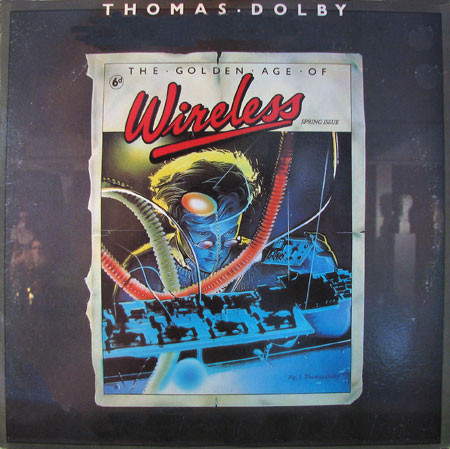

# The Golden Age Of Wireless

By Thomas Dolby

## Album Data

[Discogs URL](https://www.discogs.com/release/124983-Thomas-Dolby-The-Golden-Age-Of-Wireless)

- Label: Capitol Records
- Formats: Vinyl, LP, Album, Reissue
- Genres: Electronic, Pop, Synth-pop
- Rating: 4.08
- Released: 1983-03-00
- Year: 1982
- Release ID: 124983
- Media condition: 
- Sleeve condition: 
- Speed: 
- Weight: 
- Notes: 

## Album Tracks

| **Position** | **Title** | **Duration** |
|--------------|-----------|--------------|
| A1 | **She Blinded Me With Science** | 5:09 |
| A2 | **Radio Silence** | 4:32 |
| A3 | **Airwaves ** | 3:35 |
| A4 | **Flying North** | 3:50 |
| A5 | **Weightless** | 3:45 |
| B1 | **Europa And The Pirate Twins** | 3:18 |
| B2 | **Windpower** | 3:58 |
| B3 | **Commercial Breakup** | 4:15 |
| B4 | **One Of Our Submarines** | 5:11 |
| B5 | **Cloudburst At Shingle Street** | 5:45 |

## Artist Roles

| **Name** | **Role** |
|----------|----------|
| **Andrew Douglas** | Cover |
| **Thomas Dolby** | Cover |
| **Elisabeth Aumont** | Crew [Fruit Juice Everywhere] |
| **Lesley Fairbairn** | Crew [Personal Assistant] |
| **Bill Smith (19)** | Layout |
| **Andy Ferguson (2)** | Management |
| **Cracks 90 Ltd.** | Management |
| **Thomas Dolby** | Producer |
| **Tim Friese-Greene** | Producer |
| **Jo Kerr** | Written-By |
| **Thomas Dolby** | Written-By |
| **Tim Kerr (2)** | Written-By |

