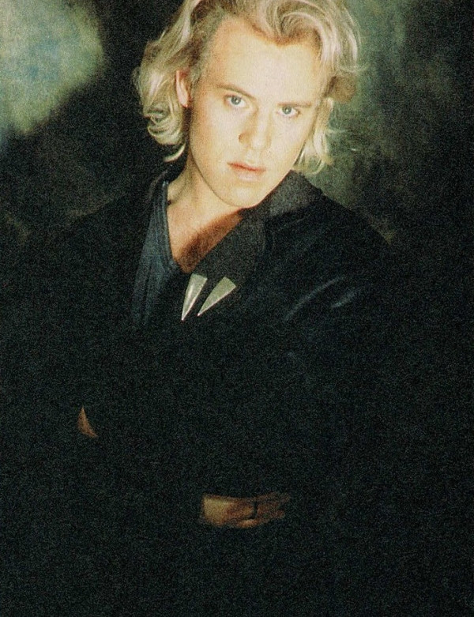

# Thomas Dolby

## Artist Profile

Singer/songwriter, musician and record producer, born on October 14, 1958 in London.

## Artist Links

- [https://www.thomasdolby.com/](https://www.thomasdolby.com/)
- [https://www.facebook.com/officialthomasdolby](https://www.facebook.com/officialthomasdolby)
- [https://www.imdb.com/name/nm0230884/](https://www.imdb.com/name/nm0230884/)
- [https://myspace.com/thomasdolby](https://myspace.com/thomasdolby)
- [https://twitter.com/thomasdolby](https://twitter.com/thomasdolby)
- [https://en.wikipedia.org/wiki/Thomas_Dolby](https://en.wikipedia.org/wiki/Thomas_Dolby)

## See also

- [Blinded By Science](Blinded_By_Science.md)
- [The Flat Earth](The_Flat_Earth.md)
- [The Golden Age Of Wireless](The_Golden_Age_Of_Wireless.md)
