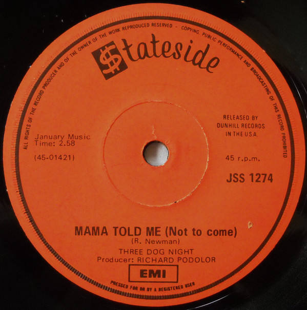

# Mama Told Me (Not To Come)

By Three Dog Night

## Album Data

[Discogs URL](https://www.discogs.com/release/2424477-Three-Dog-Night-Mama-Told-Me-Not-To-Come)

- Label: ABC/Dunhill Records
- Formats: Vinyl, 7", Single, Styrene
- Genres: Rock, Classic Rock
- Rating: 4.25
- Released: 1970
- Year: 1970
- Release ID: 2424477
- Media condition: 
- Sleeve condition: 
- Speed: 
- Weight: 
- Notes: 

## Album Tracks

| **Position** | **Title** | **Duration** |
|--------------|-----------|--------------|
| A | **Mama Told Me (Not To Come)** | 2:58 |
| B | **Rock & Roll Widow** | 2:56 |

## Artist Roles

| **Name** | **Role** |
|----------|----------|
| **Richard Podolor** | Producer |

