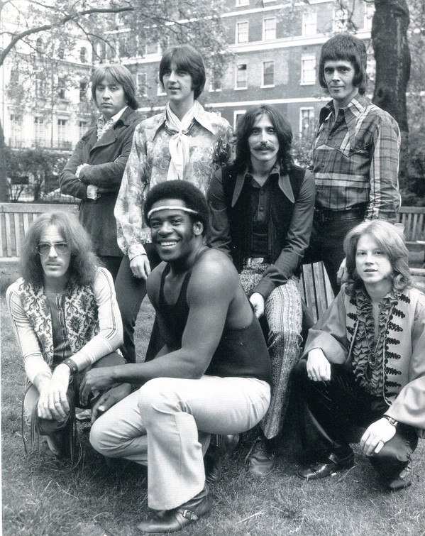

# Three Dog Night

## Artist Profile

American pop band inducted into The Vocal Group Hall Of Fame in 2000. Between 1969 and 1975, the band registered 21 Billboard Top 40 hits, including three reaching number one. The name of the band refers to an Australian saying, which is used to indicate how cold it is at night (when it's very cold, you need three dogs to keep you warm).

## Artist Links

- [https://www.threedognight.com/](https://www.threedognight.com/)
- [https://www.facebook.com/threedognight](https://www.facebook.com/threedognight)
- [https://www.imdb.com/name/nm2061571/](https://www.imdb.com/name/nm2061571/)
- [https://www.last.fm/music/Three+Dog+Night](https://www.last.fm/music/Three+Dog+Night)
- [https://en.wikipedia.org/wiki/Three_Dog_Night](https://en.wikipedia.org/wiki/Three_Dog_Night)

## See also

- [Mama Told Me (Not To Come)](Mama_Told_Me_Not_To_Come.md)
