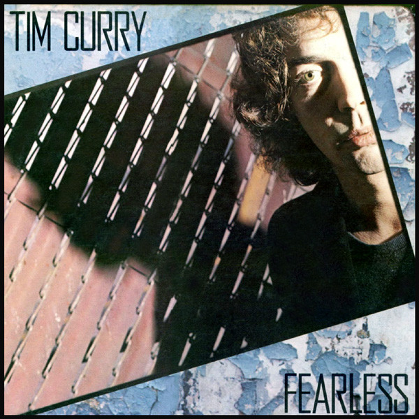

# Fearless

By Tim Curry

## Album Data

[Discogs URL](https://www.discogs.com/release/1107963-Tim-Curry-Fearless)

- Label: A&M Records
- Formats: Vinyl, LP, Album
- Genres: Rock, Pop, Pop Rock
- Rating: 3.85
- Released: 1979
- Year: 1979
- Release ID: 1107963
- Media condition: 
- Sleeve condition: 
- Speed: 
- Weight: 
- Notes: 

## Album Tracks

| **Position** | **Title** | **Duration** |
|--------------|-----------|--------------|
| A1 | **Right On The Money** | 3:14 |
| A2 | **Hide This Face** | 2:54 |
| A3 | **I Do The Rock** | 4:45 |
| A4 | **S.O.S.** | 4:16 |
| A5 | **Cold Blue Steel And Sweet Fire** | 3:34 |
| B1 | **Paradise Garage** | 6:12 |
| B2 | **No Love On The Street** | 4:52 |
| B3 | **Something Short Of Paradise** | 3:20 |
| B4 | **Charge It** | 5:16 |

## Artist Roles

| **Name** | **Role** |
|----------|----------|
| **David Sanborn** | Alto Saxophone |
| **Roland Young (3)** | Art Direction |
| **Arnold McCuller** | Backing Vocals |
| **David Lasley** | Backing Vocals |
| **Ula Hedwig** | Backing Vocals |
| **Bob Babbitt** | Bass |
| **Larry Williams (9)** | Design [Artwork By], Photography By |
| **Paula Greif** | Design [Artwork By], Photography By |
| **Charles Collins** | Drums, Percussion |
| **Bruce Tergesen** | Engineer |
| **Kevin Herron** | Engineer |
| **David Prentice** | Engineer [Assistant] |
| **Jesse Henderson (2)** | Engineer [Assistant] |
| **Jon Smith (3)** | Engineer [Assistant] |
| **Scott Macpherson** | Engineer [Assistant] |
| **Michael Kamen** | Keyboards, Oboe, Synthesizer [Arps] |
| **Dick Wagner** | Lead Guitar, Acoustic Guitar |
| **Clodagh Wallace** | Management |
| **Bob Ludwig** | Mastered By |
| **Jimmy Maelen** | Percussion |
| **Allan Schwartzberg** | Percussion [Mouth Percussion] |
| **Bette Sussman** | Piano, Other [Fender], Electric Piano [Rhodes], Clavinet, Organ |
| **Dick Wagner** | Producer |
| **Michael Kamen** | Producer |
| **Michael Tschudin** | Synthesizer |
| **Tim Curry** | Vocals |

