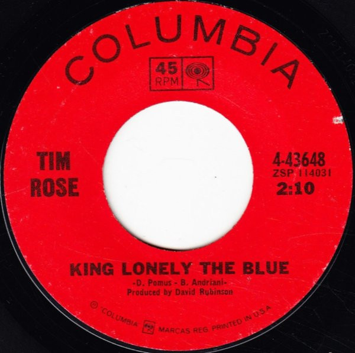

# King Lonely The Blue / Hey Joe (You Shot Your Woman Down)

By Tim Rose

## Album Data

[Discogs URL](https://www.discogs.com/release/2176149-Tim-Rose-King-Lonely-The-Blue-Hey-Joe-You-Shot-Your-Woman-Down)

- Label: Columbia
- Formats: Vinyl, 7", 45 RPM, Styrene
- Genres: Rock, Folk, World, & Country, Folk Rock, Blues Rock
- Rating: 4.67
- Released: 1966-05-16
- Year: 1966
- Release ID: 2176149
- Media condition: 
- Sleeve condition: 
- Speed: 
- Weight: 
- Notes: 

## Album Tracks

| **Position** | **Title** | **Duration** |
|--------------|-----------|--------------|
| A | **King Lonely The Blue** | 2:10 |
| B | **Hey Joe (You Shot Your Woman Down)** | 2:55 |

## Artist Roles

| **Name** | **Role** |
|----------|----------|
| **David Rubinson** | Producer |

