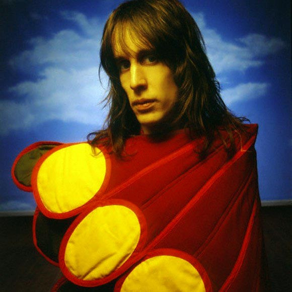

# Todd Rundgren

## Artist Profile

American musician (vocals, guitar, bass, keyboards, drums, saxophone, theremin), singer-songwriter and record producer.
Born June 22, 1948 in Upper Darby, a suburb of Philadelphia, Pennsylvania, USA.
 
Todd Rundgren began his career in blues band Woody's Truck Stop but left to form Nazz in 1967 who charted with "Open My Eyes" and "Hello It's Me." He left Nazz in 1969 to pursue a solo career and released Runt (1970), Runt: The Ballad of Todd Rundgren (1971) and double LP Something/Anything? (1972) on which he singly wrote, performed and produced 3 of the 4 sides of the album, the 4th side being a single live take with a studio band.
 
Rundgren also took on production projects for other groups at Bearsville Studios whilst his musical boundaries stretched from Pop to Heavy Metal to Soul as demonstrated by 'A Wizard, A True Star' (1973), followed by another double album 1974's Todd and 1975's Initiation. At this time he also started to release progressive and experimental live and studio material with his backing band Utopia.
 
Rundgren continued to produce solo material, notably Faithful (1976) featuring one side of originals and one side of covers from 1966, Hermit of Mink Hollow (1978), Healing (1981), The Ever Popular Tortured Artist Effect (1983) and the aptly named A Cappella (1985). Utopia disbanded in 1986 having released a string of live and studio albums under the Todd Rundgren/Utopia banner all of which featured Rundgren's seemingly inexhaustible songwriting, vocal and performance contributions.
 
After a break he released the live studio album Nearly Human (1989) followed by 2nd Wind (1991) performed before a live audience who were instructed to remain silent. In 1993 Rundgren reinvented himself again on the Internet as TR-i ("Todd Rundgren interactive") and released No World Order (1993) followed by The Individualist (1995). His Patronet work, which trickled out to subscribers over more than a year, was released in 2000 as One Long Year.
 
Rundgren returned to recording under his own name for With a Twist, an album of bossa-nova covers of his older material. Also released were Reconstructed which features techno remixes of Rundgren and Utopia tracks by other artists and Todd Rundgren and His Friends which contains various artists remakes and remixes Rundgren songs.
 
In 2004, Rundgren released Liars and in 2005, following considerable rumour and speculation it was announced that he was joining the line-up of 80's rock band The Cars, now renamed as The New Cars. A live album The New Cars: It's Alive, was released in 2006.
 
Rundgren and long term partner Bebe Buell raised actress Liv Tyler as his daughter until age 11 due to the drug excesses of her biological father, Steven Tyler of Aerosmith.

## Artist Links

- [https://www.tr-i.com/](https://www.tr-i.com/)
- [https://www.facebook.com/toddrundgren](https://www.facebook.com/toddrundgren)
- [http://trconnection.com/](http://trconnection.com/)
- [https://en.wikipedia.org/wiki/Todd_Rundgren](https://en.wikipedia.org/wiki/Todd_Rundgren)
- [https://myspace.com/toddrundgrenmusic](https://myspace.com/toddrundgrenmusic)

## See also

- [A Wizard, A True Star](A_Wizard__A_True_Star.md)
- [Time Heals](Time_Heals.md)
- [Todd](Todd.md)
