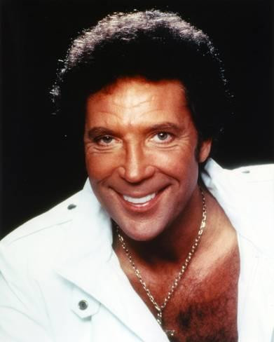

# Tom Jones

## Artist Profile

Tom Jones, OBE (born 7 June 1940, Treforest, Pontypridd, Glamorgan, Wales) is a Welsh singer.

In 1962, he became the frontman for Tommy Scott &amp; The Senators, a Welsh beat group and recorded 4 demo tracks in the football changing rooms at Pontypridd YMCA, known as the "bathroom session". In 1963, as Tommy Scott & The Playboys, they recorded 7 demos for the producer Joe Meek. In 1964, the then Tommy Scott & The Squires, met Gordon Mills (2), who became Tom's manager from 1964-1986. Capitalizing on the popularity of the Albert Finney film Tom Jones (1963), Mills made the decision to rename Jones. Mills also wrote and scored the first of Jones' many Transatlantic top 10 hits, "It's Not Unusual". By the end of the 1960s, Jones was a top 5 all-time Las Vegas headliner (1968-2010) and was playing sold out venues around the world.

From 1969 until 1971, Jones had an internationally successful television show, This Is Tom Jones. Though his record sales tailed off during the mid-1970s, peaking in 1971 with his only US No. 1 hit, "She's A Lady", he remained a huge draw as a live performer. In 1970, Jones was the first solo performer to sell out Madison Square Garden. In 1979, he made his acting debut and starred in the made-for-TV movie, Pleasure Cove. A decade earlier, a press release was issued about a possible film starring Jones and Elvis Presley but this project was never realized.

In 1986, Gordon Mills died and Jones' son Mark Woodward became his manager. In 1987, Jones returned to the UK and quickly re-established himself as a recording artist with a song that reached No. 2, "A Boy From Nowhere" (from the unstaged musical "Matador"). In 1988, he made his "comeback", collaborating with The Art Of Noise on "Kiss", written by Prince. It proved a worldwide hit and won an MTV award.

The 1990s proved Jones' versatility as he collaborated with numerous well known artists, culminating with the 1999 album "Reload". It reached No. 1 in the UK (in both 1999 and 2000) and was awarded album of the year and became his biggest selling album to date (as of 2016). This was achieved without any US sales, as the album was not released in the US due to collaborating artist copyright restrictions. Jones was appointed an Officer of the Order of the British Empire (OBE) in 1999 and knighted in 2006 for his services to music. In 2009, Jones headlined UK's Glastonbury Festival.

With worldwide sales topping 400 million and counting, Tom Jones ranks among the top 10 biggest selling artists of all time.

After nearly 60 years of marriage, his wife, Lady Melinda Rose Woodward passed away in April, 2016.

## Artist Links

- [https://www.tomjones.com/](https://www.tomjones.com/)
- [https://en.wikipedia.org/wiki/Tom_Jones_%28singer%29](https://en.wikipedia.org/wiki/Tom_Jones_%28singer%29)
- [https://www.youtube.com/channel/UCy2JIPsxsCoDK3M1BcEVGGA](https://www.youtube.com/channel/UCy2JIPsxsCoDK3M1BcEVGGA)
- [https://www.instagram.com/realsirtomjones/](https://www.instagram.com/realsirtomjones/)
- [https://twitter.com/RealSirTomJones](https://twitter.com/RealSirTomJones)
- [https://www.facebook.com/SirTomJones/](https://www.facebook.com/SirTomJones/)
- [https://www.imdb.com/name/nm0429367/](https://www.imdb.com/name/nm0429367/)

## See also

- [What A Night](What_A_Night.md)
