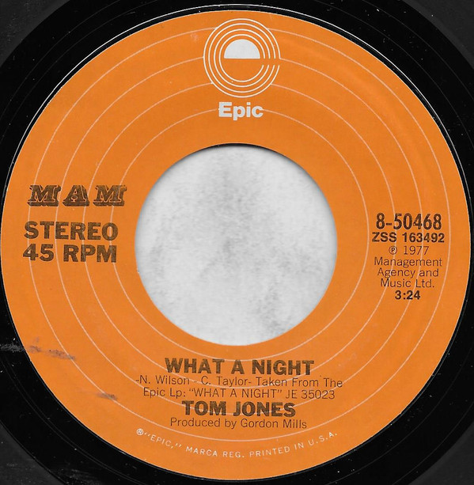

# What A Night

By Tom Jones

## Album Data

[Discogs URL](https://www.discogs.com/release/2638599-Tom-Jones-What-A-Night)

- Label: Epic
MAM
- Formats: Vinyl, 7", 45 RPM
- Genres: Pop, Folk, World, & Country, Country, Vocal
- Rating: 0
- Released: 1977-11-00
- Year: 1977
- Release ID: 2638599
- Media condition: 
- Sleeve condition: 
- Speed: 
- Weight: 
- Notes: 

## Album Tracks

| **Position** | **Title** | **Duration** |
|--------------|-----------|--------------|
| A | **What A Night** | 3:24 |
| B | **That's Where I Belong** | 3:22 |

## Artist Roles

| **Name** | **Role** |
|----------|----------|
| **Gordon Mills (2)** | Producer |

