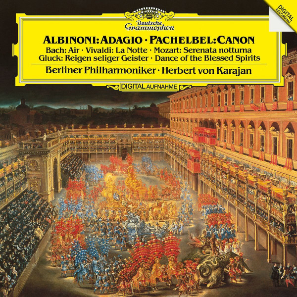

# Albinoni: Adagio, Pachelbel: Canon

By Tomaso Albinoni

## Album Data

[Discogs URL](https://www.discogs.com/release/9366153-Albinoni-Pachelbel-Berliner-Philharmoniker-Herbert-von-Karajan-Albinoni-Adagio-Pachelbel-Canon)

- Label: Deutsche Grammophon
- Formats: Vinyl, LP, Album, Reissue
- Genres: Classical, Baroque, Classical
- Rating: 4.54
- Released: 2016-11-11
- Year: 1984
- Release ID: 9366153
- Media condition: 
- Sleeve condition: 
- Speed: 
- Weight: 
- Notes: 

## Album Tracks

| **Position** | **Title** | **Duration** |
|--------------|-----------|--------------|
| A1 | **Adagio In G Minor For Strings And Organ** | 11:44 |
| A2 | **Concerto For Flutre, Strings, And Harpsichord In G Minor, Op. 10 No. 2 (RV 439)** | 9:17 |
| A3 | **Air, From Ouverture Nr. 3 D-dur BWV 1068** | 5:59 |
| B1 | **Canon And Gigue In D Major For 3 Violins And Basso Continuo** | 7:02 |
| B2 | **Dance Of The Blessed Spirits, From The Opera "Orpheus And Eurydice"** | 6:43 |
| B3 | **Serenata Notturna In D Major, K. 239** | 13:15 |

## Artist Roles

| **Name** | **Role** |
|----------|----------|
| **Herbert von Karajan** | Conductor |
| **Reinhild Schmidt** | Edited By |
| **Günter Hermanns** | Engineer |
| **Berliner Philharmoniker** | Orchestra |
| **Günther Breest** | Producer |
| **Michel Glotz** | Recording Supervisor |

