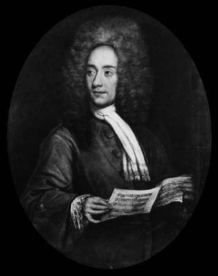

# Tomaso Albinoni

## Artist Profile

Venetian Baroque composer (born June 8, 1671, Venice, Republic of Venice - died January 17, 1751, Venice, Republic of Venice).

## Artist Links

- [https://en.wikipedia.org/wiki/Tomaso_Albinoni](https://en.wikipedia.org/wiki/Tomaso_Albinoni)
- [https://www.britannica.com/biography/Tomaso-Giovanni-Albinoni](https://www.britannica.com/biography/Tomaso-Giovanni-Albinoni)
- [https://www.bach-cantatas.com/Lib/Albinoni-Tomaso.htm](https://www.bach-cantatas.com/Lib/Albinoni-Tomaso.htm)
- [http://www.haendel.it/compositori/albinoni.htm](http://www.haendel.it/compositori/albinoni.htm)

## See also

- [Albinoni](Albinoni-_Adagio__Pachelbel-_Canon.md)
