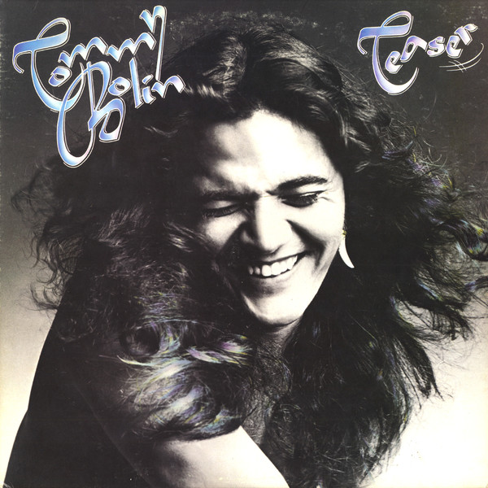

# Teaser

By Tommy Bolin

## Album Data

[Discogs URL](https://www.discogs.com/release/1057030-Tommy-Bolin-Teaser)

- Label: Nemperor Records
- Formats: Vinyl, LP, Album
- Genres: Rock, Hard Rock, Classic Rock, Heavy Metal
- Rating: 4.32
- Released: 1975
- Year: 1975
- Release ID: 1057030
- Media condition: 
- Sleeve condition: 
- Speed: 
- Weight: 
- Notes: 

## Album Tracks

| **Position** | **Title** | **Duration** |
|--------------|-----------|--------------|
| A1 | **The Grind** | 3:26 |
| A2 | **Homeward Strut** | 3:55 |
| A3 | **Dreamer** | 5:08 |
| A4 | **Savannah Woman** | 2:45 |
| A5 | **Teaser** | 4:27 |
| B1 | **People, People** | 4:55 |
| B2 | **Marching Powder** | 4:14 |
| B3 | **Wild Dogs** | 4:10 |
| B4 | **Lotus** | 3:56 |

## Artist Roles

| **Name** | **Role** |
|----------|----------|
| **David Brown (44)** | Backing Vocals |
| **Lee Kiefer** | Backing Vocals |
| **The Sniffettes** | Backing Vocals |
| **Tommy Bolin** | Backing Vocals |
| **Paul Stallworth** | Bass |
| **Stanley Sheldon** | Bass |
| **Bobby Berge** | Drums |
| **Jan Hammer** | Drums |
| **Jeff Porcaro** | Drums |
| **Narada Michael Walden** | Drums |
| **Prairie Prince** | Drums |
| **Lee Kiefer** | Engineer |
| **Michael Bronstein** | Engineer [Assistant] |
| **Dennis MacKay** | Engineer [Remix] |
| **Davey Moire** | Engineer [Second] |
| **Tommy Bolin** | Guitar |
| **Jan Hammer** | Organ |
| **Phil Collins** | Percussion |
| **Raphael Cruz** | Percussion |
| **Sammy Figueroa** | Percussion |
| **David Foster** | Piano |
| **Jan Hammer** | Piano |
| **Ron Fransen** | Piano |
| **Tommy Bolin** | Piano |
| **Lee Kiefer** | Producer |
| **Tommy Bolin** | Producer |
| **David Sanborn** | Saxophone |
| **David Foster** | Synthesizer |
| **Jan Hammer** | Synthesizer |
| **Tommy Bolin** | Synthesizer [Arp] |
| **Tommy Bolin** | Vocals |

