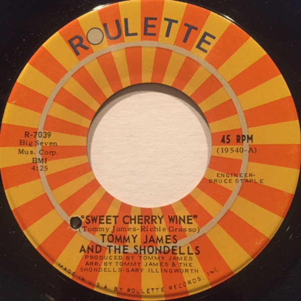

# Sweet Cherry Wine / Breakaway

By Tommy James & The Shondells

## Album Data

[Discogs URL](https://www.discogs.com/release/1472814-Tommy-James-And-The-Shondells-Sweet-Cherry-Wine-Breakaway)

- Label: Roulette
- Formats: Vinyl, 7", 45 RPM, Single
- Genres: Rock, Pop, Rock & Roll, Pop Rock
- Rating: 3.88
- Released: 1969
- Year: 1969
- Release ID: 1472814
- Media condition: 
- Sleeve condition: 
- Speed: 
- Weight: 
- Notes: 

## Album Tracks

| **Position** | **Title** | **Duration** |
|--------------|-----------|--------------|
| A | **Sweet Cherry Wine** | 4:25 |
| B | **Breakaway** | 2:45 |

## Artist Roles

| **Name** | **Role** |
|----------|----------|
| **Tommy James & The Shondells** | Arranged By |
| **Bruce Staple** | Engineer |
| **Tommy James** | Producer, Written-By |

