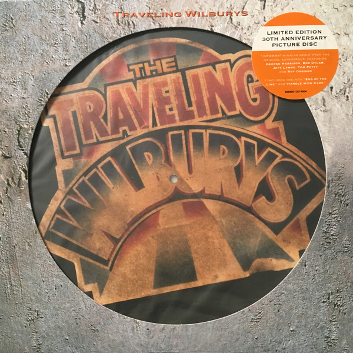

# Volume One

By Traveling Wilburys

## Album Data

[Discogs URL](https://www.discogs.com/release/1574267-Traveling-Wilburys-Volume-One)

- Label: Wilbury Records
Wilbury Records
- Formats: Vinyl, LP, Album
- Genres: Rock, Pop, Folk, World, & Country, Rock & Roll, Pop Rock, Country Rock
- Rating: 4.41
- Released: 1988-10-18
- Year: 1988
- Release ID: 1574267
- Media condition: 
- Sleeve condition: 
- Speed: 
- Weight: 
- Notes: 

## Album Tracks

| **Position** | **Title** | **Duration** |
|--------------|-----------|--------------|
| A1 | **Handle With Care** | 3:20 |
| A2 | **Dirty World** | 3:30 |
| A3 | **Rattled** | 3:00 |
| A4 | **Last Night** | 3:48 |
| A5 | **Not Alone Any More** | 3:24 |
| B1 | **Congratulations** | 3:30 |
| B2 | **Heading For The Light** | 3:37 |
| B3 | **Margarita** | 3:16 |
| B4 | **Tweeter And The Monkey Man** | 5:30 |
| B5 | **End Of The Line** | 3:30 |

## Artist Roles

| **Name** | **Role** |
|----------|----------|
| **Charlie T. Jnr Wilbury** | Acoustic Guitar, Vocals, Backing Vocals |
| **Lefty Wilbury** | Acoustic Guitar, Vocals, Backing Vocals |
| **Lucky Wilbury** | Acoustic Guitar, Vocals, Backing Vocals |
| **David Costa** | Art Direction |
| **Jim Keltner** | Drums |
| **Bill Bottrell** | Engineer |
| **Don Smith** | Engineer |
| **Phil McDonald** | Engineer |
| **Richard Dodd** | Engineer |
| **Steve Hall** | Mastered By |
| **Ray Cooper** | Percussion |
| **Neal Preston** | Photography By [Band] |
| **Chris Smith (5)** | Photography By [Sleeve] |
| **Gered Mankowitz** | Photography By [Sleeve] |
| **Nelson Wilbury** | Producer, Guitar, Vocals, Backing Vocals |
| **Otis Wilbury** | Producer, Keyboards, Guitar, Vocals, Backing Vocals |
| **Jim Horn** | Saxophone |
| **Hugh Jampton** | Sleeve Notes |
| **Traveling Wilburys** | Written-By |

