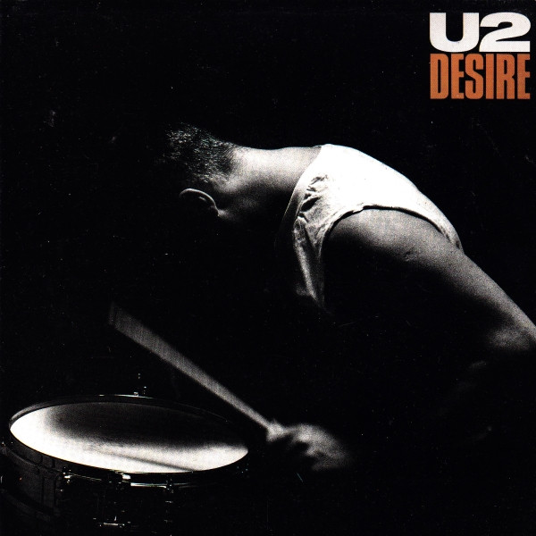

# Desire

By U2

## Album Data

[Discogs URL](https://www.discogs.com/release/750205-U2-Desire)

- Label: Island Records
- Formats: Vinyl, 7", 45 RPM, Single
- Genres: Rock, Pop Rock
- Rating: 4.04
- Released: 1988
- Year: 1988
- Release ID: 750205
- Media condition: 
- Sleeve condition: 
- Speed: 
- Weight: 
- Notes: 

## Album Tracks

| **Position** | **Title** | **Duration** |
|--------------|-----------|--------------|
| A | **Desire** | 2:59 |
| B | **Hallelujah Here She Comes** | 4:12 |

## Artist Roles

| **Name** | **Role** |
|----------|----------|
| **DZN, The Design Group** | Design |
| **Steve Averill** | Design [Based On An Idea By] |
| **Works Associates** | Design [Based On An Idea By] |
| **U2** | Music By |
| **Anton Corbijn** | Photography By |
| **Bill Rubenstein (2)** | Photography By [Back Cover] |
| **Jimmy Iovine** | Producer |
| **Bono** | Words By |

