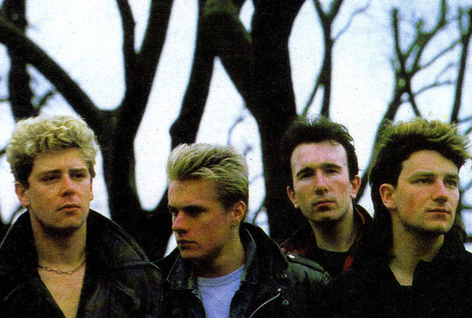

# U2

## Artist Profile

U2 are an Irish rock band from Dublin, formed in 1976. They began their legacy rooting their music in the political turmoil that was all around them.

After having Steve Lillywhite produce their first three albums, U2 looked for a more sophisticated and experimental sound. They hired Daniel Lanois and Brian Eno to produce "The Unforgettable Fire" and "The Joshua Tree" albums, which both put them onto the charts all over the world.

After the 80s ended U2 re-invented themselves once again. Incorporating elements of electronics into their rock construct, U2 created a new sound with "Achtung Baby". Bono and the band used their notoriety more than ever expressing their opinions on social matters on a global scale.

Inducted into Rock And Roll Hall of Fame in 2005 (Performer).

Members:
Paul David Hewson (aka Bono)
David Howell Evans (aka The Edge)
Adam Charles Clayton
Lawrence Joseph Mullen Jr.

## Artist Links

- [https://www.u2.com/](https://www.u2.com/)
- [http://u2discography.free.fr/u2/index.html](http://u2discography.free.fr/u2/index.html)
- [https://www.u2songs.com/](https://www.u2songs.com/)
- [https://u2-3.com/](https://u2-3.com/)
- [https://myspace.com/u2](https://myspace.com/u2)
- [https://en.wikipedia.org/wiki/U2](https://en.wikipedia.org/wiki/U2)
- [https://www.last.fm/music/U2](https://www.last.fm/music/U2)
- [https://www.facebook.com/u2](https://www.facebook.com/u2)
- [https://www.youtube.com/user/U2official](https://www.youtube.com/user/U2official)
- [https://u2kite.com/](https://u2kite.com/)
- [http://www.u2wanderer.org/](http://www.u2wanderer.org/)

## See also

- [Angel Of Harlem](Angel_Of_Harlem.md)
- [Desire](Desire.md)
