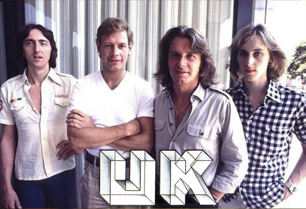

# UK

## Artist Profile

Short-lived English supergroup founded in 1977 by John Wetton, Bill Bruford (ex-King Crimson), Eddie Jobson and Allan Holdsworth. For the second and last studio album, Holdsworth left and Bruford was replaced by Terry Bozzio. They were active between 1977 - 1979, and reformed in 2012 with Eddie Jobson and John Wetton, with guest musicians. Wetton died in 2017.

## Artist Links

- [https://en.wikipedia.org/wiki/U.K._(band)](https://en.wikipedia.org/wiki/U.K._(band))
- [https://www.facebook.com/EJ.UK.fanpage/](https://www.facebook.com/EJ.UK.fanpage/)

## See also

- [Danger Money](Danger_Money.md)
