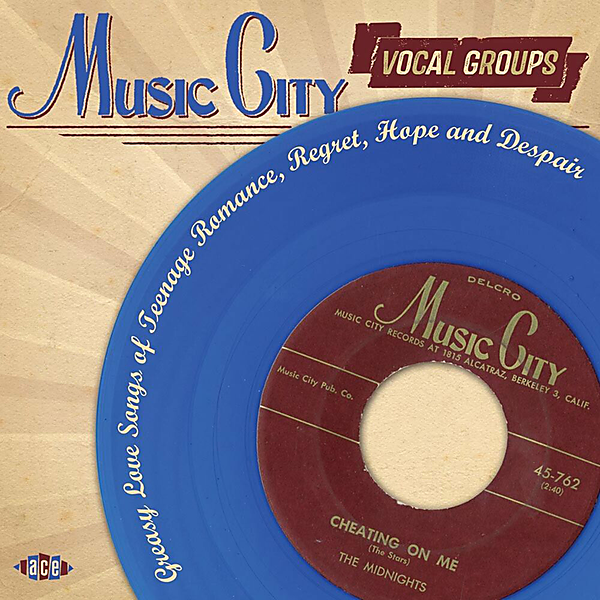

# Leslie Plus 2 Integrated Sound System: A Whole New World Of "Multi-Planar" Sound!

By Unknown Artist

## Album Data

[Discogs URL](https://www.discogs.com/release/5455966-Unknown-Artist-Leslie-Plus-2-Integrated-Sound-System-A-Whole-New-World-Of-Multi-Planar-Sound)

- Label: Leslie
Leslie
- Formats: Vinyl, 7", 33 ⅓ RPM
- Genres: Jazz, Non-Music, Classical, Promotional, Technical
- Rating: 0
- Released: null
- Year: 0
- Release ID: 5455966
- Media condition: 
- Sleeve condition: 
- Speed: 
- Weight: 
- Notes: 

## Album Tracks

| **Position** | **Title** | **Duration** |
|--------------|-----------|--------------|
| A | **Narration And Standing Wave Test** |  |
| B | **Test Music** |  |

## Artist Roles

| **Name** | **Role** |
|----------|----------|
| **Ralph Eck** | Lacquer Cut By |

