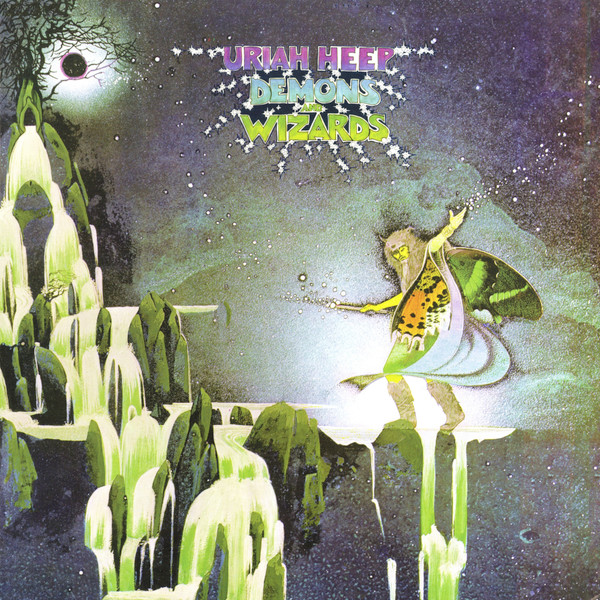

# Demons And Wizards

By Uriah Heep

## Album Data

[Discogs URL](https://www.discogs.com/release/4923117-Uriah-Heep-Demons-And-Wizards)

- Label: Wax Cathedral
Wax Cathedral
- Formats: Vinyl, LP, Album, Reissue, Remastered
- Genres: Rock, Prog Rock, Hard Rock
- Rating: 4.7
- Released: 2013
- Year: 1972
- Release ID: 4923117
- Media condition: 
- Sleeve condition: 
- Speed: 
- Weight: 
- Notes: 

## Album Tracks

| **Position** | **Title** | **Duration** |
|--------------|-----------|--------------|
| A1 | **The Wizard** | 2:59 |
| A2 | **Traveller In Time** | 3:26 |
| A3 | **Easy Livin'** | 2:36 |
| A4 | **Poet's Justice** | 4:14 |
| A5 | **Circle Of Hands** | 6:34 |
| B1 | **Rainbow Demon** | 4:30 |
| B2 | **All My Life** | 2:46 |
| B3a | **Paradise** | 12:41 |
| B3b | **The Spell** |  |

## Artist Roles

| **Name** | **Role** |
|----------|----------|
| **Gary Thain** | Bass |
| **Lee Kerslake** | Drums, Percussion |
| **Peter Gallen** | Engineer |
| **Ashley Howe** | Engineer [Assistant] |
| **Mick Box** | Guitar |
| **Ken Hensley** | Keyboards, Guitar, Percussion |
| **Gerry Bron** | Producer |
| **David Byron** | Vocals |
| **Uriah Heep** | Voice |

