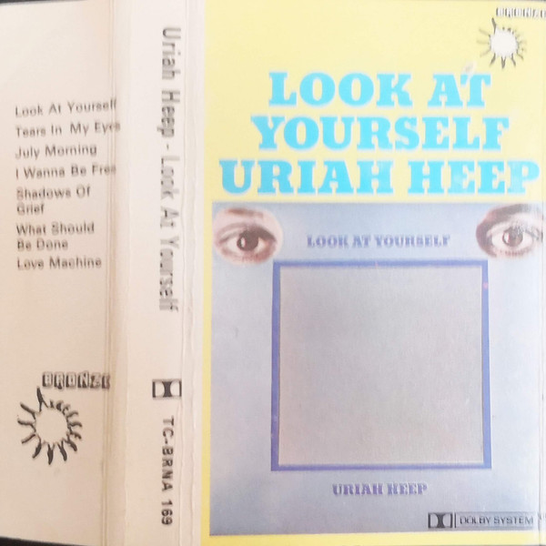

# Look At Yourself

By Uriah Heep

## Album Data

[Discogs URL](https://www.discogs.com/release/7564790-Uriah-Heep-Look-At-Yourself)

- Label: Sanctuary Records
BMG
Bronze
- Formats: Vinyl, LP, Album, Reissue, Stereo
- Genres: Rock, Hard Rock, Prog Rock
- Rating: 4.63
- Released: 2015
- Year: 1971
- Release ID: 7564790
- Media condition: 
- Sleeve condition: 
- Speed: 
- Weight: 
- Notes: 

## Album Tracks

| **Position** | **Title** | **Duration** |
|--------------|-----------|--------------|
| A1 | **Look At Yourself** | 5:07 |
| A2 | **I Wanna Be Free** | 3:59 |
| A3 | **July Morning** | 10:36 |
| B1 | **Tears In My Eyes** | 5:02 |
| B2 | **Shadows Of Grief** | 8:40 |
| B3 | **What Should Be Done** | 4:13 |
| B4 | **Love Machine** | 3:37 |

## Artist Roles

| **Name** | **Role** |
|----------|----------|
| **Uriah Heep** | Arranged By |
| **Paul Newton (2)** | Bass Guitar |
| **Douglas Maxwell Ltd.** | Design |
| **Mick Box** | Lead Guitar, Acoustic Guitar |
| **David Byron** | Lead Vocals |
| **Ken Hensley** | Liner Notes |
| **KR (3)** | Mastered By |
| **Ken Hensley** | Organ, Piano, Guitar, Acoustic Guitar, Vocals |
| **Tony Evans (8)** | Photography By |
| **Gerry Bron** | Producer |

