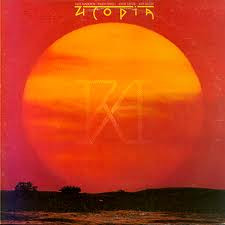

# Ra

By Utopia

## Album Data

[Discogs URL](https://www.discogs.com/release/4821992-Utopia-Ra)

- Label: Bearsville
Rhino Records (2)
- Formats: Vinyl, LP, Album, Reissue, Remastered
- Genres: Rock, Pop Rock, Prog Rock
- Rating: 4.29
- Released: 1987
- Year: 1977
- Release ID: 4821992
- Media condition: 
- Sleeve condition: 
- Speed: 
- Weight: 
- Notes: 

## Album Tracks

| **Position** | **Title** | **Duration** |
|--------------|-----------|--------------|
| A1 | **Ouverture: Montainpop And Sunrise / Communion With The Sun** | 7:15 |
| A2 | **Magic Dragon Theatre** | 3:28 |
| A3 | **Jealousy** | 4:43 |
| A4 | **Eternal Love** | 4:51 |
| A5 | **Sunburst Finish** | 7:38 |
| B1 | **Hiroshima** | 7:16 |
| B2 | **Singring And The Glass Guitar (An Electrified Fairytale)** | 18:24 |

## Artist Roles

| **Name** | **Role** |
|----------|----------|
| **Kasim Sulton** | Bass, Vocals |
| **Willie Wilcox** | Drums, Percussion, Vocals |
| **John Holbrook** | Engineer |
| **Tom Mark** | Engineer [Assistant] |
| **Todd Rundgren** | Guitar, Vocals, Producer |
| **Roger Powell** | Keyboards, Synthesizer, Vocals |
| **Ken Perry** | Mastered By |

