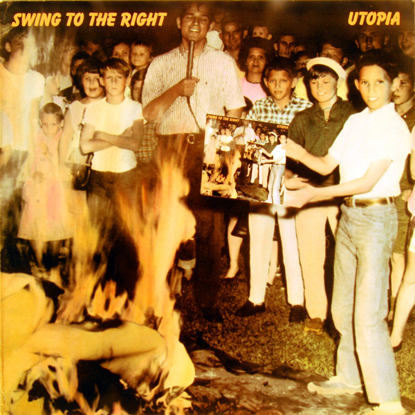

# Swing To The Right

By Utopia

## Album Data

[Discogs URL](https://www.discogs.com/release/1732070-Utopia-Swing-To-The-Right)

- Label: Bearsville
- Formats: Vinyl, LP, Album, Stereo
- Genres: Rock
- Rating: 3.55
- Released: 1982-02-24
- Year: 1982
- Release ID: 1732070
- Media condition: 
- Sleeve condition: 
- Speed: 
- Weight: 
- Notes: 

## Album Tracks

| **Position** | **Title** | **Duration** |
|--------------|-----------|--------------|
| A1 | **Swing To The Right** | 4:20 |
| A2 | **Lysistrata** | 2:42 |
| A3 | **The Up** | 4:07 |
| A4 | **Junk Rock (Million Monkeys)** | 3:17 |
| A5 | **Shinola** | 5:17 |
| B1 | **For The Love Of Money** | 3:41 |
| B2 | **Last Dollar On Earth** | 4:11 |
| B3 | **Fahrenheit 451** | 2:47 |
| B4 | **Only Human** | 5:09 |
| B5 | **One World** | 3:24 |

## Artist Roles

| **Name** | **Role** |
|----------|----------|
| **John Wagman** | Art Direction |
| **Geoffrey Thomas (2)** | Artwork [Tinting] |
| **Walt Behnke** | Cover |
| **Lisa Amowitz** | Design |
| **The Creative Directors Inc.** | Design |
| **Chris Andersen** | Engineer [(Engineered By] |
| **Todd Rundgren** | Engineer [(Engineered By] |
| **Eric Gardner (3)** | Management |
| **Ted Jensen** | Mastered By |
| **Kasim Sulton** | Performer |
| **Roger Powell** | Performer |
| **Todd Rundgren** | Performer |
| **Willie Wilcox** | Performer |
| **United Press International** | Photography By [Photo Credits] |
| **Todd Rundgren** | Producer |
| **Utopia (5)** | Producer |
| **Utopia (5)** | Written-By |

