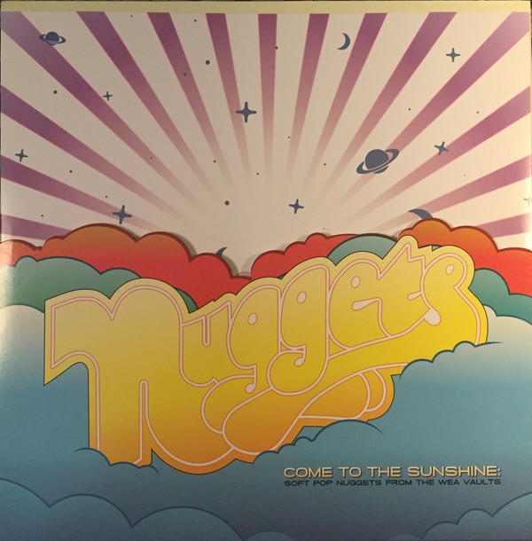

# Come To The Sunshine: Soft Pop Nuggets From The WEA Vaults

By Various

## Album Data

[Discogs URL](https://www.discogs.com/release/10134041-Various-Come-To-The-Sunshine-Soft-Pop-Nuggets-From-The-WEA-Vaults)

- Label: Rhino Records (2)
Rhino Records (2)
Rhino Handmade
Rhino Handmade
- Formats: Vinyl, LP, Compilation, Limited Edition
- Genres: Rock, Soft Rock, Pop Rock
- Rating: 4.39
- Released: 2017-04-22
- Year: 2004
- Release ID: 10134041
- Media condition: 
- Sleeve condition: 
- Speed: 
- Weight: 
- Notes: 

## Album Tracks

| **Position** | **Title** | **Duration** |
|--------------|-----------|--------------|
| A1 | **Come To The Sunshine** |  |
| A2 | **Candy Apple, Cotton Candy** |  |
| A3 | **A Whole Lot Of Rainbows** |  |
| A4 | **Love-In** |  |
| A5 | **Talking To The Flowers** |  |
| A6 | **Our Dream** |  |
| B1 | **Take My Hand** |  |
| B2 | **Come On In** |  |
| B3 | **Just What I've Been Looking For** |  |
| B4 | **Silver And Sunshine (How Wonderful Is Our Love)** |  |
| B5 | **Happiness** |  |
| B6 | **If You Know What I Mean** |  |
| C1 | **Wounded** |  |
| C2 | **Hung Up On Love** |  |
| C3 | **For All That I Am** |  |
| C4 | **Summer Days, Summer Nights** |  |
| C5 | **Discrepency** |  |
| C6 | **Scorpio Red** |  |
| D1 | **Beverly Hills** |  |
| D2 | **Tell Someone That You Love Them** |  |
| D3 | **Time To Love** |  |
| D4 | **Someday Man** |  |
| D5 | **Trip To Loveland** |  |
| D6 | **No One Was There (Requiem)** |  |

## Artist Roles

| **Name** | **Role** |
|----------|----------|
| **Rory Wilson** | Art Direction, Illustration |
| **Andrew Sandoval** | Compilation Producer |
| **Ian Sefchick** | Lacquer Cut By |
| **Bill Inglot** | Remastered By |
| **Dan Hersch** | Remastered By |

