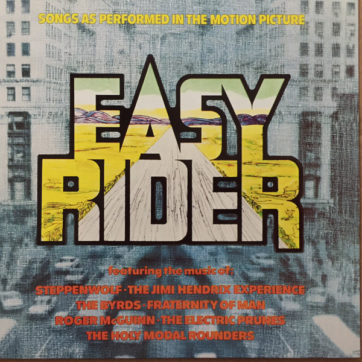

# Easy Rider (Music From The Soundtrack)

By Various

## Album Data

[Discogs URL](https://www.discogs.com/release/6169141-Various-Easy-Rider-Music-From-The-Soundtrack)

- Label: ABC/Dunhill Records
- Formats: Vinyl, LP, Compilation
- Genres: Rock, Stage & Screen, Soundtrack, Classic Rock
- Rating: 3.98
- Released: 1969-08-00
- Year: 1969
- Release ID: 6169141
- Media condition: 
- Sleeve condition: 
- Speed: 
- Weight: 
- Notes: 

## Album Tracks

| **Position** | **Title** | **Duration** |
|--------------|-----------|--------------|
| A1 | **The Pusher** | 5:48 |
| A2 | **Born To Be Wild** | 3:29 |
| A3 | **The Weight** | 4:29 |
| A4 | **Wasn't Born To Follow** | 2:03 |
| A5 | **If You Want To Be A Bird** | 2:35 |
| B1 | **Don't Bogart Me** | 3:02 |
| B2 | **If Six Was Nine** | 5:32 |
| B3 | **Kyrie Eleison** | 4:02 |
| B4 | **It's Alright Ma (I'm Only Bleeding)** | 3:03 |
| B5 | **Ballad Of Easy Rider** | 2:13 |

