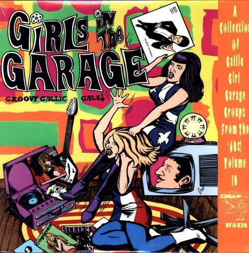

# Girls In The Garage Volume 10 - Groovy Gallic Gals!

By Various

## Album Data

[Discogs URL](https://www.discogs.com/release/10172582-Various-Girls-In-The-Garage-Volume-10-Groovy-Gallic-Gals)

- Label: Past & Present Records
- Formats: Vinyl, LP, Compilation, Limited Edition, Numbered, Reissue
- Genres: Rock, Garage Rock, Rock & Roll, Yé-Yé
- Rating: 4.16
- Released: 2017-04-22
- Year: 0
- Release ID: 10172582
- Media condition: 
- Sleeve condition: 
- Speed: 
- Weight: 
- Notes: 

## Album Tracks

| **Position** | **Title** | **Duration** |
|--------------|-----------|--------------|
| A1 | **Un Garçon Dit A Une Fille** |  |
| A2 | **Le Blue Beat** |  |
| A3 | **Faut Savoir** |  |
| A4 | **La Chanson Bête Et Méchante** |  |
| A5 | **Vis Ta Vie Mon Gars** |  |
| A6 | **Un Tours Dehors** |  |
| A7 | **La Moustache A Papa** |  |
| A8 | **Je Prends Tout Mon Temps** |  |
| B1 | **Lorsque Je Frappe A Ta Porte** |  |
| B2 | **Un Garçon En Mini-Jupe** |  |
| B3 | **Le Jeu Du Téléphone** |  |
| B4 | **On M'A Toujours Dit** |  |
| B5 | **Je Ne Sais Pourquoi** |  |
| B6 | **Les Gémeaux** |  |
| B7 | **Ils Pataugent** |  |
| B8 | **Cresoxipropanedial En Capsules** |  |
| B9 | **Trempe Tes Pieds Dans Le Gange** |  |

## Artist Roles

| **Name** | **Role** |
|----------|----------|
| **Mimi La Twisteuse** | Compiled By |

