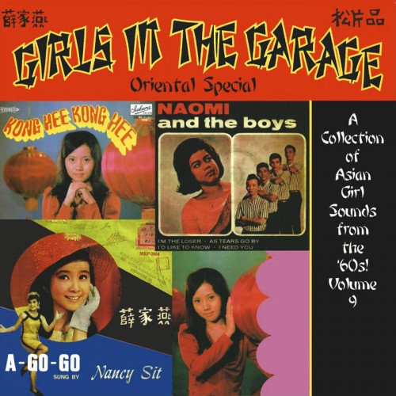

# Girls In The Garage Volume 9 - Oriental Special

By Various

## Album Data

[Discogs URL](https://www.discogs.com/release/10168773-Various-Girls-In-The-Garage-Volume-9-Oriental-Special)

- Label: Past & Present Records
- Formats: Vinyl, LP, Compilation, Limited Edition, Numbered, Reissue
- Genres: Rock, Garage Rock, Pop Rock
- Rating: 4.18
- Released: 2017-04-22
- Year: 0
- Release ID: 10168773
- Media condition: 
- Sleeve condition: 
- Speed: 
- Weight: 
- Notes: 

## Album Tracks

| **Position** | **Title** | **Duration** |
|--------------|-----------|--------------|
| A1 | **Kung See, Kung See, Let's Be Happy** |  |
| A2 | **Hanky Panky** |  |
| A3 | **Run For Your Life** |  |
| A4 | **Sugar Town** |  |
| A5 | **Love Potion #9** |  |
| A6 | **Yummy, Yummy, Yummy** |  |
| A7 | **If You Ever Go** |  |
| B1 | **As Tears Go By** |  |
| B2 | **I'd Like To Know** |  |
| B3 | **How To Catch A Girl** |  |
| B4 | **Hanky Panky** |  |
| B5 | **My Boy Lollipop** |  |
| B6 | **Come Back When You Grow Up** |  |
| B7 | **Fever** |  |

## Artist Roles

| **Name** | **Role** |
|----------|----------|
| **Bradley Ghoulstein** | Compiled By |

