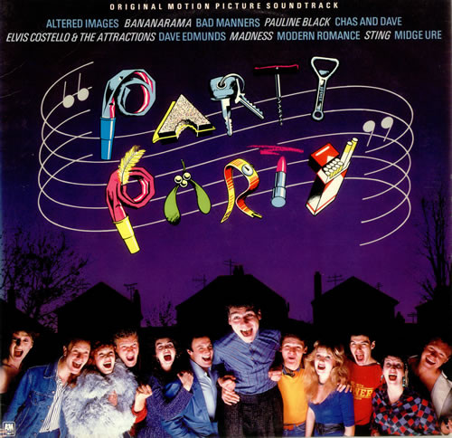

# Party Party (Original Motion Picture Soundtrack)

By Various

## Album Data

[Discogs URL](https://www.discogs.com/release/2714496-Various-Party-Party-Original-Motion-Picture-Soundtrack)

- Label: A&M Records
- Formats: Vinyl, LP, Compilation
- Genres: Rock, New Wave
- Rating: 3.38
- Released: 1982
- Year: 1982
- Release ID: 2714496
- Media condition: 
- Sleeve condition: 
- Speed: 
- Weight: 
- Notes: 

## Album Tracks

| **Position** | **Title** | **Duration** |
|--------------|-----------|--------------|
| A1 | **Party Party** | 3:15 |
| A2 | **Run Rudolph Run** | 3:46 |
| A3 | **Little Town Flirt** | 2:43 |
| A4 | **Yakety Yak** | 2:30 |
| A5 | **Tutti Frutti** | 2:17 |
| A6 | **No Feelings** | 2:34 |
| A7 | **Driving My Car** | 3:17 |
| B1 | **Band Of Gold** | 3:07 |
| B2 | **Elizabethan Reggae** | 2:19 |
| B3 | **No Woman, No Cry** | 3:41 |
| B4 | **Need Your Love So Bad** | 5:11 |
| B5 | **The Man Who Sold The World** | 5:50 |
| B6 | **Auld Lang Syne** | 1:55 |

## Artist Roles

| **Name** | **Role** |
|----------|----------|
| **Michael Ross (3)** | Art Direction |
| **Michael Ross (3)** | Design |
| **Derek Green** | Executive-Producer |
| **John Brown (5)** | Photography By [Back] |
| **Janette Beckman** | Photography By [Front/sleeve] |
| **Barbara Reeves** | Sleeve |

