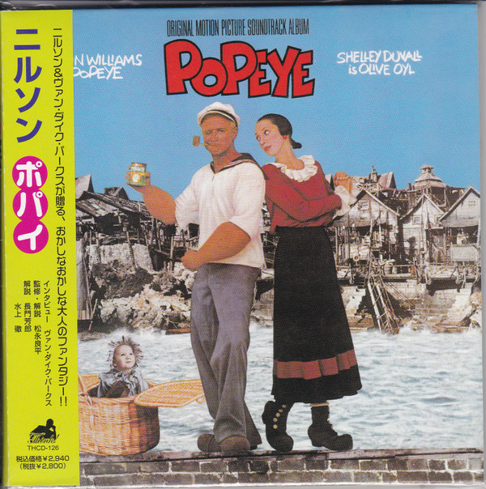

# Popeye - Original Motion Picture Soundtrack Album

By Various

## Album Data

[Discogs URL](https://www.discogs.com/release/2137850-Various-Popeye-Original-Motion-Picture-Soundtrack-Album)

- Label: The Boardwalk Entertainment Co
The Boardwalk Entertainment Co
- Formats: Vinyl, LP, Album
- Genres: Stage & Screen, Soundtrack
- Rating: 3.83
- Released: 1980
- Year: 1980
- Release ID: 2137850
- Media condition: 
- Sleeve condition: 
- Speed: 
- Weight: 
- Notes: 

## Album Tracks

| **Position** | **Title** | **Duration** |
|--------------|-----------|--------------|
| A1 | **I Yam What I Yam (Popeye's Declaration Of Self)** | 2:15 |
| A2 | **He Needs Me (Olive Acknowledges Popeye)** | 3:31 |
| A3 | **Swee'pea's Lullaby (Popeye's Note To Swee'pea)** | 2:02 |
| A4 | **Din' We (Bill Barnacle's Lament)** | 3:03 |
| A5 | **Sweethaven (An Anthem)** | 2:53 |
| A6 | **Blow Me Down (Popeye Enters Sweethaven)** | 4:07 |
| B1 | **Sailin' (Popeye And Olive Sing To Swee'pee)** | 2:46 |
| B2 | **It's Not Easy Being Me (Poopdeck Pappy Is Held Hostage By Bluto)** | 2:17 |
| B3 | **He's Large (The Eve Of Olive's Engagement To Bluto)** | 4:20 |
| B4 | **I'm Mean (Bluto)** | 2:32 |
| B5 | **Kids (Poopdeck Pappy's Opinion)** | 4:24 |
| B6 | **I'm Popeye The Sailor Man (Boop! Boop!)** | 1:22 |

## Artist Roles

| **Name** | **Role** |
|----------|----------|
| **Van Dyke Parks** | Arranged By, Conductor |
| **Christopher Whorf** | Design |
| **Rick Riccio** | Engineer |
| **Bob Gravenor** | Engineer [Location Recording] |
| **Phil Dunne** | Engineer [Location Recording] |
| **Randy Honaker** | Engineer [Location Recording] |
| **Mike Hatcher** | Engineer [Second Engineer] |
| **Brian Gardner** | Lacquer Cut By [Runout Etching ❀] |
| **The Mysterious Karsten** | Organ |
| **Doug Dillard** | Performer [The Falcons] |
| **Harry Nilsson** | Performer [The Falcons] |
| **Klaus Voormann** | Performer [The Falcons] |
| **Ray Cooper** | Performer [The Falcons] |
| **The Mysterious Karsten** | Performer [The Falcons] |
| **Van Dyke Parks** | Performer [The Falcons] |
| **Harry Nilsson** | Written-By, Producer |

