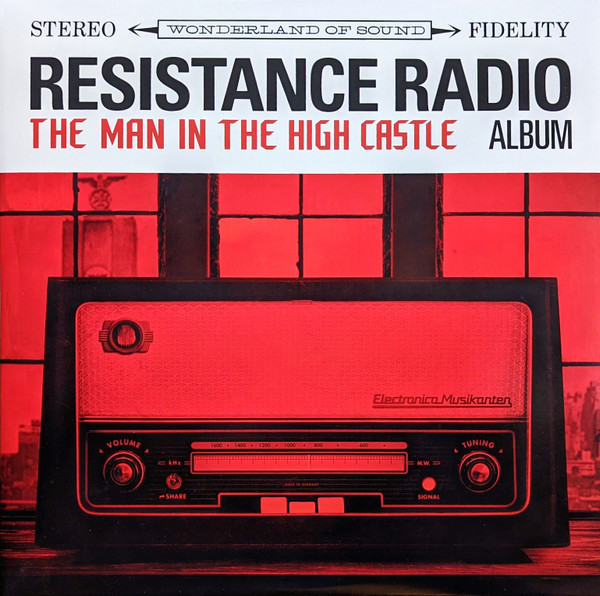

# Resistance Radio: The Man In The High Castle Album

By Various

## Album Data

[Discogs URL](https://www.discogs.com/release/10104107-Various-Resistance-Radio-The-Man-In-The-High-Castle-Album)

- Label: Columbia
30th Century Records
- Formats: Vinyl, LP, Compilation
- Genres: Rock, Pop, Stage & Screen, Soundtrack
- Rating: 4.34
- Released: 2017-05-19
- Year: 2017
- Release ID: 10104107
- Media condition: 
- Sleeve condition: 
- Speed: 
- Weight: 
- Notes: 

## Album Tracks

| **Position** | **Title** | **Duration** |
|--------------|-----------|--------------|
| A1 | **The End Of The World** | 2:58 |
| A2 | **Nature Boy** | 2:41 |
| A3 | **Can't Help Falling In Love** | 3:13 |
| A4 | **Spoonful** | 2:48 |
| A5 | **The House Of The Rising Sun** | 2:27 |
| B1 | **A Taste Of Honey** | 3:17 |
| B2 | **Who's Sorry Now** | 2:19 |
| B3 | **Speaking Of Happiness** | 2:46 |
| B4 | **Sometimes I Feel Like A Motherless Child** | 3:33 |
| C1 | **Love Hurts** | 3:22 |
| C2 | **Lonely Mound Of Clay** | 3:14 |
| C3 | **I Only Have Eyes For You** | 4:00 |
| C4 | **Who's Lovin' You** | 3:40 |
| D1 | **Unchained Melody** | 2:49 |
| D2 | **Lead Me On ** | 2:36 |
| D3 | **All Alone Am I** | 3:12 |
| D4 | **Living In A Trance** | 3:03 |
| D5 | **Get Happy** | 2:14 |

## Artist Roles

| **Name** | **Role** |
|----------|----------|
| **Christina Toth** | Coordinator [Music Coordinator for Amazon Studios] |
| **Annie Stoll** | Design |
| **Brian Burton** | Executive-Producer |
| **KM (5)** | Lacquer Cut By |
| **Bob Bowen** | Management [Head of Music for Amazon Studios], Product Manager [Executive Album Producer] |
| **Melyssa Hardwick** | Management [TV Music Creative for Amazon Studios] |
| **Joe LaPorta** | Mastered By |
| **Michael H. Brauer** | Mixed By |
| **Danger Mouse** | Producer |
| **Sam Cohen** | Producer |
| **Sam Cohen** | Recorded By |
| **Eric Giordano** | Recorded By [Assisted By] |

