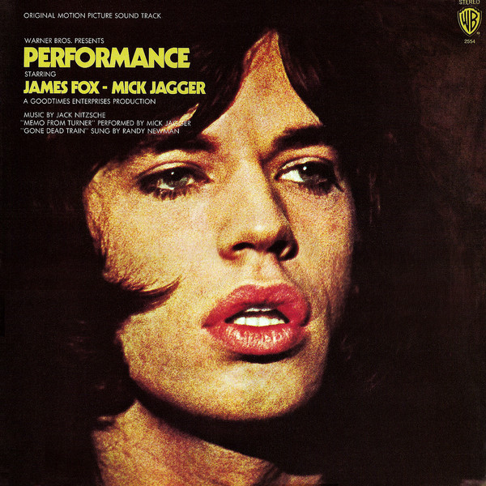

# Performance: Original Motion Picture Sound Track

By Various

## Album Data

[Discogs URL](https://www.discogs.com/release/1863304-Various-Performance-Original-Motion-Picture-Sound-Track)

- Label: Warner Bros. Records
- Formats: Vinyl, LP
- Genres: Electronic, Rock, Funk / Soul, Blues, Stage & Screen, Blues Rock, Acoustic, Abstract, Psychedelic, Soundtrack
- Rating: 3.94
- Released: 1970
- Year: 1970
- Release ID: 1863304
- Media condition: 
- Sleeve condition: 
- Speed: 
- Weight: 
- Notes: 

## Album Tracks

| **Position** | **Title** | **Duration** |
|--------------|-----------|--------------|
| A1 | **Gone Dead Train** | 2:55 |
| A2 | **Performance** | 1:47 |
| A3 | **Get Away** | 2:05 |
| A4 | **Powis Square** | 2:23 |
| A5 | **Rolls Royce And Acid** | 1:47 |
| A6 | **Dyed, Dead, Red** | 2:32 |
| A7 | **Harry Flowers** | 4:00 |
| B1 | **Memo From Turner** | 4:02 |
| B2 | **The Hashishin** | 3:35 |
| B3 | **Wake Up, Niggers** | 2:43 |
| B4 | **Poor White Hound Dog** | 2:45 |
| B5 | **Natural Magic** | 1:37 |
| B6 | **Turner's Murder** | 4:15 |

## Artist Roles

| **Name** | **Role** |
|----------|----------|
| **Ed Thrasher** | Art Direction |
| **Bob West** | Bass |
| **Randy Newman** | Conductor |
| **Ken Duskin** | Design [Package Design] |
| **Gene Parsons** | Drums |
| **Lowell George** | Guitar |
| **Russ Titelman** | Guitar |
| **Milt Holland** | Percussion |
| **Jack Nitzsche** | Producer, Arranged By |
| **Nasser Rastegar-Nejad** | Santoor |
| **Bernie Krause** | Synthesizer [Moog] |
| **Jack Nitzsche** | Written-By |

