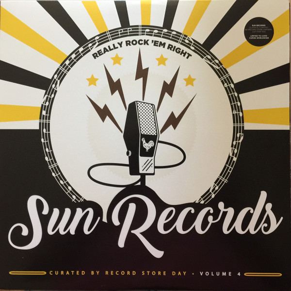

# Really Rock 'em Right - Sun Records Curated By Record Store Day Volume 4

By Various

## Album Data

[Discogs URL](https://www.discogs.com/release/10174655-Various-Really-Rock-em-Right-Sun-Records-Curated-By-Record-Store-Day-Volume-4)

- Label: Sun (9)
- Formats: Vinyl, LP, Compilation, Limited Edition
- Genres: Rock, Blues, Folk, World, & Country, Country Blues, Hillbilly, Rockabilly
- Rating: 4.23
- Released: 2017-04-22
- Year: 2017
- Release ID: 10174655
- Media condition: 
- Sleeve condition: 
- Speed: 
- Weight: 
- Notes: 

## Album Tracks

| **Position** | **Title** | **Duration** |
|--------------|-----------|--------------|
| A1 | **How Many More Years** |  |
| A2 | **Baby No No** |  |
| A3 | **A Cat Called Domino** |  |
| A4 | **Milkshake Mademoiselle** |  |
| A5 | **Matchbox** |  |
| A6 | **Ridin' The Boogie** |  |
| B1 | **Get Rhythm** |  |
| B2 | **Ubangi Stomp** |  |
| B3 | **Put Your Cat Clothes On** |  |
| B4 | **Juiced** |  |
| B5 | **My Baby** |  |
| B6 | **Jelly Roll King** |  |

## Artist Roles

| **Name** | **Role** |
|----------|----------|
| **Candace Cox Mache** | A&R, Sleeve Notes |
| **Leticia Llesmin** | Artwork, Design |
| **Carrie Colliton** | Coordinator |
| **Michael Kurtz** | Coordinator |
| **Andrew Rossiter** | Other [Marketing] |

