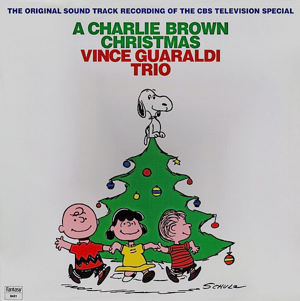

# A Charlie Brown Christmas

By Vince Guaraldi Trio

## Album Data

[Discogs URL](https://www.discogs.com/release/394949-Vince-Guaraldi-Trio-A-Charlie-Brown-Christmas)

- Label: Fantasy
Fantasy
- Formats: Vinyl, LP, Album, Reissue
- Genres: Jazz, Stage & Screen, Contemporary Jazz
- Rating: 4.72
- Released: 1988
- Year: 1965
- Release ID: 394949
- Media condition: 
- Sleeve condition: 
- Speed: 
- Weight: 
- Notes: 

## Album Tracks

| **Position** | **Title** | **Duration** |
|--------------|-----------|--------------|
| A1 | **O Tannenbaum** | 5:03 |
| A2 | **What Child Is This** | 2:20 |
| A3 | **My Little Drum** | 3:15 |
| A4 | **Linus And Lucy** | 3:03 |
| A5 | **Christmas Time Is Here (Instrumental)** | 6:06 |
| B1 | **Christmas Time Is Here (Vocal)** | 2:44 |
| B2 | **Skating** | 2:24 |
| B3 | **Hark, The Herald Angels Sing** | 1:55 |
| B4 | **Christmas Is Coming** | 3:22 |
| B5 | **Für Elise** | 1:02 |
| B6 | **The Christmas Song** | 3:15 |
| B7 | **Greensleeves** | 5:25 |

## Artist Roles

| **Name** | **Role** |
|----------|----------|
| **Monty Budwig** | Bass |
| **Charles M. Schulz** | Cover |
| **Colin Bailey** | Drums |
| **Ralph J. Gleason** | Liner Notes |
| **George Horn** | Mastered By [Mastering (1988)] |
| **Vince Guaraldi** | Piano |

