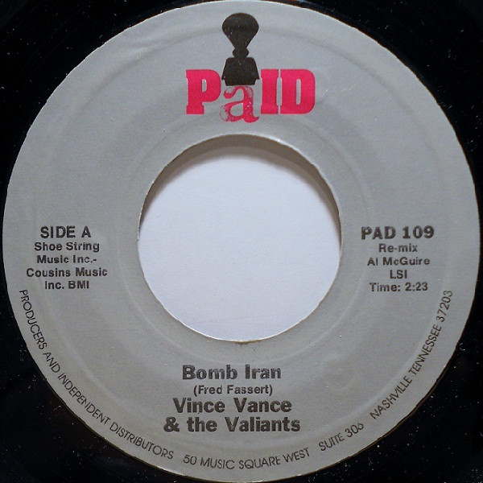

# Bomb Iran

By Vince Vance & The Valiants

## Album Data

[Discogs URL](https://www.discogs.com/release/3408709-Vince-Vance-The-Valiants-Bomb-Iran)

- Label: PaID
- Formats: Vinyl, 7", Single, Styrene
- Genres: Rock, Pop, Novelty
- Rating: 2.5
- Released: 1980
- Year: 1980
- Release ID: 3408709
- Media condition: 
- Sleeve condition: 
- Speed: 
- Weight: 
- Notes: 

## Album Tracks

| **Position** | **Title** | **Duration** |
|--------------|-----------|--------------|
| A | **Bomb Iran** | 2:23 |
| B | **Bye-Bye Baby** | 2:46 |

