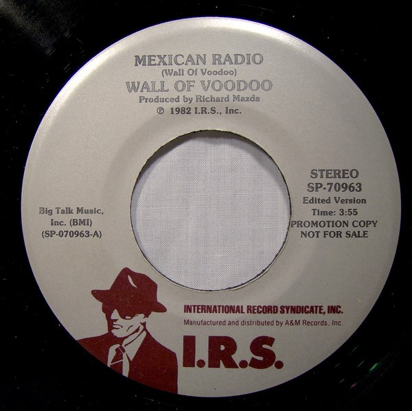

# Mexican Radio

By Wall Of Voodoo

## Album Data

[Discogs URL](https://www.discogs.com/release/7638955-Wall-Of-Voodoo-Mexican-Radio)

- Label: I.R.S. Records
- Formats: Vinyl, 7", 45 RPM, Single, Promo
- Genres: Electronic, Rock, New Wave
- Rating: 5
- Released: 1982
- Year: 1982
- Release ID: 7638955
- Media condition: 
- Sleeve condition: 
- Speed: 
- Weight: 
- Notes: 

## Album Tracks

| **Position** | **Title** | **Duration** |
|--------------|-----------|--------------|
| A | **Mexican Radio (Stereo)** | 3:55 |
| B | **Mexican Radio (Mono)** | 3:55 |

