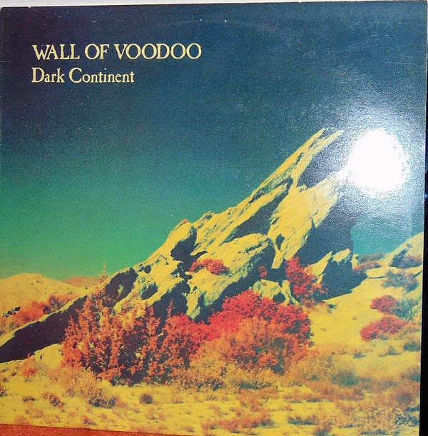

# Dark Continent

By Wall Of Voodoo

## Album Data

[Discogs URL](https://www.discogs.com/release/900624-Wall-Of-Voodoo-Dark-Continent)

- Label: I.R.S. Records
- Formats: Vinyl, LP, Album
- Genres: Electronic, Rock, New Wave
- Rating: 4.34
- Released: 1981
- Year: 1981
- Release ID: 900624
- Media condition: 
- Sleeve condition: 
- Speed: 
- Weight: 
- Notes: 

## Album Tracks

| **Position** | **Title** | **Duration** |
|--------------|-----------|--------------|
| A1 | **Red Light** | 3:05 |
| A2 | **Two Minutes Till Lunch** | 2:15 |
| A3 | **Untitled** | 0:36 |
| A4 | **Animal Day** | 3:14 |
| A5 | **Full Of Tension** | 2:12 |
| A6 | **Me And My Dad** | 3:23 |
| A7 | **Back In Flesh** | 3:40 |
| B1 | **Tse Tse Fly** | 3:59 |
| B2 | **Untitled** | 0:41 |
| B3 | **Call Box** | 2:32 |
| B4 | **This Way Out** | 2:59 |
| B5 | **Good Times** | 2:28 |
| B6 | **Crack The Bell** | 3:31 |

## Artist Roles

| **Name** | **Role** |
|----------|----------|
| **Philip Culp** | Art Direction, Design |
| **Bruce Moreland** | Bass, Keyboards |
| **Joe Nanini** | Drums, Percussion |
| **Kirk Ferraioli** | Engineer [Assistant] |
| **Jim Hill** | Engineer, Producer |
| **Paul McKenna** | Engineer, Producer |
| **Marc Moreland** | Guitar |
| **Stan Ridgway** | Harmonica, Keyboards, Vocals |
| **Chas T. Gray** | Keyboards |
| **Scott Lindgren** | Photography By |
| **Wall Of Voodoo** | Producer, Written-By |

