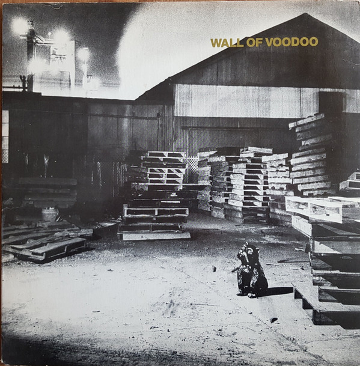

# Wall Of Voodoo

By Wall Of Voodoo

## Album Data

[Discogs URL](https://www.discogs.com/release/1080848-Wall-Of-Voodoo-Wall-Of-Voodoo)

- Label: Index
- Formats: Vinyl, 12", 33 ⅓ RPM, EP
- Genres: Electronic, Rock, Alternative Rock, New Wave
- Rating: 4.21
- Released: 1980-11-00
- Year: 1980
- Release ID: 1080848
- Media condition: 
- Sleeve condition: 
- Speed: 
- Weight: 
- Notes: 

## Album Tracks

| **Position** | **Title** | **Duration** |
|--------------|-----------|--------------|
| A1 | **Longarm** | 3:44 |
| A2 | **The Passenger** | 4:07 |
| B1 | **Can't Make Love** | 3:47 |
| B2 | **Struggle** | 2:14 |
| B3 | **Ring Of Fire** | 4:59 |
| B4 | **Granma's House** | 0:55 |

## Artist Roles

| **Name** | **Role** |
|----------|----------|
| **Bruce Moreland** | Bass, Piano |
| **Index Images** | Design |
| **Jim Hill** | Engineer |
| **Marc Moreland** | Guitar |
| **Jeff Sanders** | Mastered By |
| **Joe Nanini** | Percussion |
| **Scott Lindgren** | Photography By |
| **Wall Of Voodoo** | Producer, Cover [Cover Concept] |
| **Chas T. Gray** | Synthesizer |
| **Stan Ridgway** | Vocals, Organ |
| **Wall Of Voodoo** | Written-By |

