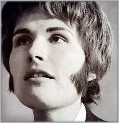

# Walter Carlos

## Artist Profile

Electronic musician Wendy Carlos was born (as Walter Carlos) in 1939 in Pawtucket, Rhode Island (USA) and developed a significant interest in both music and technology. At the age of 10 she composed her first piece of music and at 14 built a small computer which won her a Westinghouse Science Fair scholarship. Three years later she assembled an electronic music studio and created her first electronic musical composition via tape manipulation.

At Brown University (1958-1962), Carlos studied music and physics and informally taught electronic music. While earning a Master's degree in music at Columbia University (1962-1965) she did extensive work at the Columbia-Princeton Electronic Music Center studying under composer and electronic music pioneer Vladimir Ussachevsky and recording early compositions such as Dialogues for Piano and Two Loudspeakers and Variations for Flute and Electronic Sound. During this period Wendy also assisted conductor Leonard Bernstein in a concert of electronic music at the Lincoln Center Philharmonic Hall and later found employment at Gotham Recording Studios as a recording, mastering, and cutting engineer.

With the wish to develop an electronic instrument which had the capacity for more expression and genuine musicality than most equipment could provide at that time, Carlos began a collaboration with engineer Robert Moog in 1966. The result was an ongoing evolution of the standard Moog synthesizer incorporating Carlos' suggestions and needs. The bulk of the performances found on Carlos' releases from 1968-1980 were realized on the Moog, though a few other instruments (including a Yamaha Electone organ) were also used.

In 1972 Carlos underwent the final stage of gender reassignment and changed her name from Walter to Wendy Carlos, though the transition from Walter to Wendy as credited on recordings and projects did not arrive until the release of Switched-On Brandenburgs and The Shining (Original Sound Track) in 1980. Eventually reissues of Switched-On Bach were also modified to reflect her transition, and all of the East Side Digital reissues from the late 90s/early 2000s had their credits modified to reflect this as well. Wendy has stated on her website via a dedicated page that she does not wish to discuss her past as Walter or her gender reassignment. 

Further information can be found at the profile page for Wendy Carlos.

## Artist Links

- [http://www.wendycarlos.com/](http://www.wendycarlos.com/)
- [https://en.wikipedia.org/wiki/Wendy_Carlos](https://en.wikipedia.org/wiki/Wendy_Carlos)
- [https://synthmuseum.com/magazine/0102cw.html](https://synthmuseum.com/magazine/0102cw.html)
- [https://www.imdb.com/name/nm0137793/](https://www.imdb.com/name/nm0137793/)

## See also

- [Walter Carlos' Clockwork Orange](Walter_Carlos_Clockwork_Orange.md)
