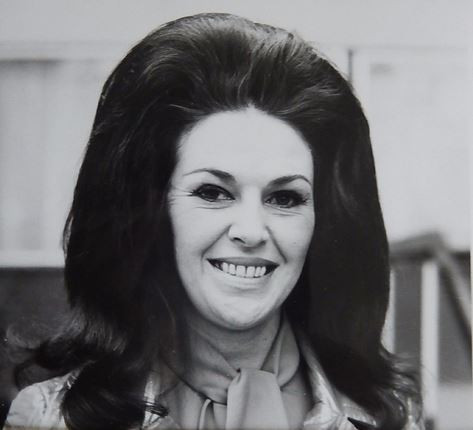

# Wanda Jackson

## Artist Profile

Born : October 20, 1937 // Maud, OK, United States
Wanda Jackson was the first female rock and roll singer in the United States, releasing her debut record in 1956. She is often hailed as the "Queen Of Rockabilly."

Inducted into Rock And Roll Hall of Fame in 2009 (Early Influence).

## Artist Links

- [http://www.wandajackson.com/](http://www.wandajackson.com/)
- [https://www.instagram.com/wandajofficial/](https://www.instagram.com/wandajofficial/)
- [https://www.pledgemusic.com/artists/wandajackson](https://www.pledgemusic.com/artists/wandajackson)
- [https://en.wikipedia.org/wiki/Wanda_Jackson](https://en.wikipedia.org/wiki/Wanda_Jackson)

## See also

- [Rockin' With Wanda](Rockin_With_Wanda.md)
