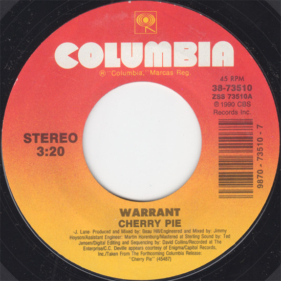

# Cherry Pie

By Warrant

## Album Data

[Discogs URL](https://www.discogs.com/release/2635820-Warrant-Cherry-Pie)

- Label: Columbia
- Formats: Vinyl, 7", 45 RPM, Single, Styrene
- Genres: Rock, Hard Rock, Glam
- Rating: 4.6
- Released: 1990
- Year: 1990
- Release ID: 2635820
- Media condition: 
- Sleeve condition: 
- Speed: 
- Weight: 
- Notes: 

## Album Tracks

| **Position** | **Title** | **Duration** |
|--------------|-----------|--------------|
| A | **Cherry Pie** | 3:20 |
| B | **Thin Disguise** | 3:14 |

## Artist Roles

| **Name** | **Role** |
|----------|----------|
| **Dave Collins** | Edited By [Digital Editing And Sequencing] |
| **Martin Horenburg** | Engineer [Assistant] |
| **Jimmy Hoyson** | Engineer, Mixed By |
| **Ted Jensen** | Mastered By |
| **Beau Hill** | Producer [Produced By], Mixed By |

