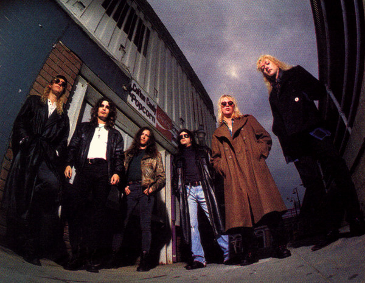

# Warrant

## Artist Profile

Hair / Glam Metal (Heavy Metal) band from Los Angeles, California (USA). 

The band was formed in 1984.

Current Line-Up
Robert Mason: Vocals (2008 - present)
Erik Turner: Guitars (1984 - present)
Joey Allen: Guitars (1987 - 1994, 2004 - present)
Jerry Dixon: Bass (1984 - present)
Steven Sweet: Drums (1986 - 1994, 2004 - present)

Fomrer Members:
Adam Shore: Vocals (1984 - 1985)
Jani Lane: Vocals, Guitars (1986 - 1993, 1994 - 2004)

Josh Lewis: Guitar (1984 - 1986)
Rick Steier: Guitar (1994 - 2000)
Keri Kelli: Guitar (2000)
Billy Morris: Guitar (2000 - 2004)

Jim Wright: Drums (1982 - 1984)
Max Asher: Drums (1984 - 1985)
James Kottak: Drums (1994 - 1996)
Bobby Borg: Drums (1996 - 1997)
Vik Foxx: Drums (1997 - 1998)
Danny Wagner: Drums (1998 - 2000)
Mike Fasano: Drums (2000, 2003)
Kevin Pharis: Drums (2003 - 2004)

Dave White: Keyboards (1992-1994)
Scott Warren: Keyboards (1989-1991)
Danny Wagner: Keyboards (1995-1997)
Shawn Zavodney: Keyboards (2001-2004)

## Artist Links

- [http://www.warrantrocks.com/](http://www.warrantrocks.com/)
- [https://www.facebook.com/warrantrocks/](https://www.facebook.com/warrantrocks/)
- [https://twitter.com/warrantrocks](https://twitter.com/warrantrocks)
- [https://www.instagram.com/warrantrocks/](https://www.instagram.com/warrantrocks/)
- [https://www.youtube.com/user/OfficialWarrant/](https://www.youtube.com/user/OfficialWarrant/)
- [https://en.wikipedia.org/wiki/Warrant_(American_band)](https://en.wikipedia.org/wiki/Warrant_(American_band))
- [https://www.imdb.com/name/nm1655465/](https://www.imdb.com/name/nm1655465/)

## See also

- [Cherry Pie](Cherry_Pie.md)
