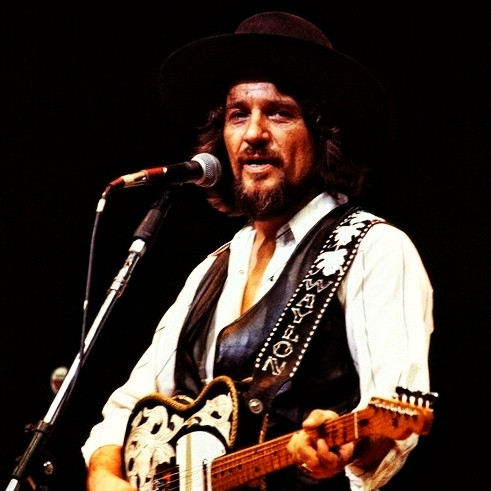

# Waylon Jennings

## Artist Profile

American Country singer, born June 15, 1937, Littlefield, Texas and died February 13, 2002, Chandler, Arizona.
Jennings first played guitar at age eight and first performed at age twelve on KVOW radio, after which he formed his first band, The Texas Longhorns. Jennings left high school at age sixteen, determined to become a musician, and bounced around as a performer and DJ on KVOW, KDAV, KYTI, KLLL, in Coolidge, Arizona, and Phoenix. 
In 1958, Buddy Holly arranged Jennings's first recording session, and hired him to play bass. Jennings gave up his seat on the ill-fated flight in 1959 that crashed and killed Holly, J. P. "The Big Bopper" Richardson and Ritchie Valens. 
Jennings formed a rockabilly club band, The Waylors, which became the house band at "JD's", a club in Scottsdale, Arizona. He recorded for Trend (9) and some other indie labels then for A&amp;M Records, but did not achieve success until moving to RCA Victor
His career turning point became the critically acclaimed album Honky Tonk Heroes written mostly by Billy Joe Shaver. During the 1970s, Jennings was instrumental in the inception of outlaw country and with Willie Nelson, Tompall Glaser, and his wife, Jessi Colter recorded country music's first platinum album, Wanted! The Outlaws
In the 80s he joined the country supergroup The Highwaymen with Willie Nelson, Kris Kristofferson, and Johnny Cash, which released three albums between 1985 and 1995. During that period, Jennings released the successful album Will The Wolf Survive.
He toured less after 1997 to spend more time with his family. Between 1999 and 2001, his appearances were limited by health problems. He joined another super group, Old Dogs with Bobby Bare, Jerry Reed, and Mel Tillis with songs mostly written by Shel Silverstein. In 2001, he was inducted into the Country Music Hall of Fame. In 2007, he was posthumously awarded the Cliffie Stone Pioneer Award by the Academy of Country Music. 
He was married to Jessi Colter they had a son, Shooter Jennings. His step daughter is Jennifer Jennings, step grandson Struggle Jennings and step great grand daughter Brianna Harness

## Artist Links

- [http://en.wikipedia.org/wiki/Waylon_Jennings](http://en.wikipedia.org/wiki/Waylon_Jennings)
- [http://repertoire.bmi.com/Catalog.aspx?detail=writerid&page=1&fromrow=1&torow=25&keyid=171984&subid=1](http://repertoire.bmi.com/Catalog.aspx?detail=writerid&page=1&fromrow=1&torow=25&keyid=171984&subid=1)

## See also

- [Are You Ready For The Country](Are_You_Ready_For_The_Country.md)
