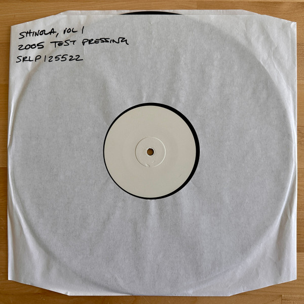

# Shinola Vol.1

By Ween

## Album Data

[Discogs URL](https://www.discogs.com/release/8410855-Ween-Shinola-Vol1)

- Label: Schnitzel Records
- Formats: Vinyl, LP, Album, Compilation, Repress
- Genres: Electronic, Rock, Alternative Rock, Synth-pop
- Rating: 4.58
- Released: 2009-12-21
- Year: 2005
- Release ID: 8410855
- Media condition: 
- Sleeve condition: 
- Speed: 
- Weight: 
- Notes: 

## Album Tracks

| **Position** | **Title** | **Duration** |
|--------------|-----------|--------------|
| A1 | **Tastes Good On Th' Bun** |  |
| A2 | **Boys Club** |  |
| A3 | **I Fell In Love Today** |  |
| A4 | **Big Fat Fuck** |  |
| A5 | **Gabrielle** |  |
| A6 | **Did You See Me?** |  |
| B7 | **How High Can You Fly** |  |
| B8 | **Transitions** |  |
| B9 | **Israel** |  |
| B10 | **The Rift** |  |
| B11 | **Monique The Freak** |  |
| B12 | **Someday** |  |

## Artist Roles

| **Name** | **Role** |
|----------|----------|
| **Emily Lazar** | Mastered By |
| **Andrew Weiss** | Mixed By, Producer |
| **Dean Ween** | Performer, Written-By |
| **Gene Ween** | Performer, Written-By |
| **Tom Nichols (5)** | Photography By |
| **Ween** | Producer |

