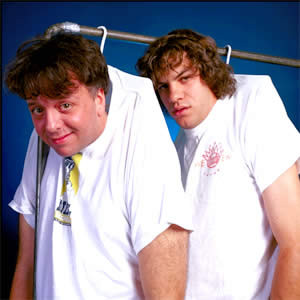

# Ween

## Artist Profile

Alternative rock duo from New Hope, PA, U.S.A.
Active from 1984 until 2012, and returning from a hiatus in 2015.

The core members of Ween are: 
Aaron Freeman (Gene Ween)
Mickey Melchiondo (Dean Ween)
Claude Coleman
Glenn McClelland
Dave Dreiwitz

## Artist Links

- [http://www.ween.com/](http://www.ween.com/)
- [https://brownbase.org/](https://brownbase.org/)
- [https://en.wikipedia.org/wiki/Ween](https://en.wikipedia.org/wiki/Ween)
- [https://www.facebook.com/ween](https://www.facebook.com/ween)
- [http://www.ween.net/](http://www.ween.net/)

## See also

- [Shinola Vol.1](Shinola_Vol1.md)
