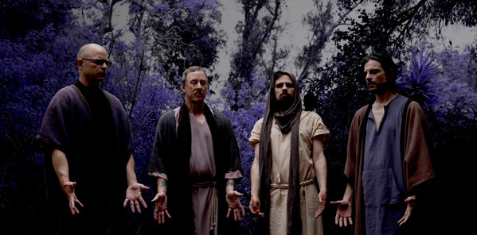

# Weezer

## Artist Profile

Rock band from Los Angeles, California, US.
Formed in 1992.

Current members:
Rivers Cuomo - Lead vocals/Lead guitar/Keys (1992-)
Patrick Wilson - Drums/Percussion/Backing vocals (1992-)
Brian Bell - Rhythm/Lead guitar/Backing vocals/Keys (1993-)
Scott Shriner - Bass/Backing vocals/Keys (2001-)

Former members:
Jason Cropper - Rhythm guitar (1992-1993)
Matt Sharp - Bass (1992-1998)
Mikey Welsh - Bass (1998-2001)

## Artist Links

- [Website - https://weezer.com/](Website - https://weezer.com/)
- [Facebook - https://www.facebook.com/weezer/](Facebook - https://www.facebook.com/weezer/)
- [Twitter - https://twitter.com/Weezer](Twitter - https://twitter.com/Weezer)
- [Instagram - https://www.instagram.com/weezer/](Instagram - https://www.instagram.com/weezer/)
- [MySpace - https://myspace.com/weezer](MySpace - https://myspace.com/weezer)
- [Soundcloud - https://soundcloud.com/weezer](Soundcloud - https://soundcloud.com/weezer)
- [YouTube - https://www.youtube.com/user/weezer](YouTube - https://www.youtube.com/user/weezer)
- [Wiki - https://en.wikipedia.org/wiki/Weezer](Wiki - https://en.wikipedia.org/wiki/Weezer)

## See also

- [Maladroit](Maladroit.md)
