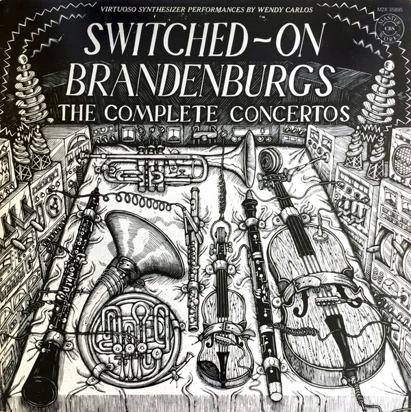

# Switched-On Brandenburgs (The Complete Concertos)

By Wendy Carlos

## Album Data

[Discogs URL](https://www.discogs.com/release/1873893-Wendy-Carlos-Switched-On-Brandenburgs-The-Complete-Concertos)

- Label: CBS Masterworks
- Formats: Vinyl, LP, Compilation, Stereo
- Genres: Electronic, Classical, Modern Classical, Baroque
- Rating: 4.34
- Released: 1980
- Year: 1980
- Release ID: 1873893
- Media condition: 
- Sleeve condition: 
- Speed: 
- Weight: 
- Notes: 

## Album Tracks

| **Position** | **Title** | **Duration** |
|--------------|-----------|--------------|
|  | **Concerto No. 1 In F Major, BWV 1046** |  |
|  | **Concerto No. 3 In G Major, BWV 1048** |  |
|  | **Concerto No. 4 In G Major, BWV 1049** |  |
|  | **Concerto No. 5 In D Major, BWV 1050** |  |
|  | **Concerto No. 2 In F Major. BWV 1047** |  |
|  | **Concerto No. 6 In B Flat Major, BWV 1051 ** |  |

## Artist Roles

| **Name** | **Role** |
|----------|----------|
| **Johann Sebastian Bach** | Composed By |
| **Andrea Klein** | Design |
| **John Berg** | Design |
| **James Grashow** | Illustration [Woodcut] |
| **Wendy Carlos** | Interviewee |
| **Allan Kozinn** | Liner Notes, Interviewer |
| **Rachel Elkind** | Producer |

