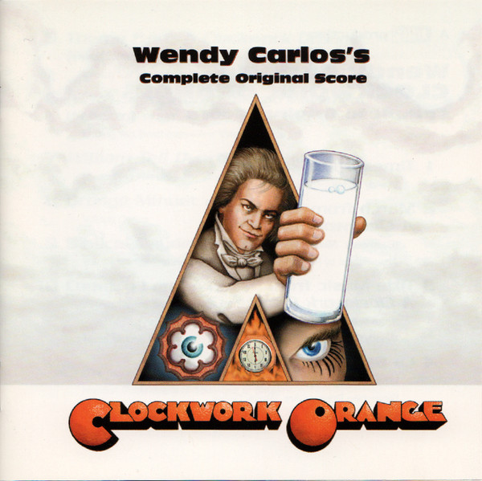

# Wendy Carlos's Clockwork Orange (Complete Original Score)

By Wendy Carlos

## Album Data

[Discogs URL](https://www.discogs.com/release/193356-Wendy-Carlos-Wendy-Carloss-Clockwork-Orange-Complete-Original-Score)

- Label: East Side Digital
- Formats: CD, Album, Enhanced, Remastered
- Genres: Electronic, Stage & Screen, Soundtrack, Modern Classical
- Rating: 4.7
- Released: 2000-04-28
- Year: 1972
- Release ID: 193356
- Media condition: 
- Sleeve condition: 
- Speed: 
- Weight: 
- Notes: 

## Album Tracks

| **Position** | **Title** | **Duration** |
|--------------|-----------|--------------|
| 1 | **Timesteps** | 13:50 |
| 2 | **March From A Clockwork Orange** | 7:00 |
| 3 | **Title Music From A Clockwork Orange** | 2:21 |
| 4 | **La Gazza Ladra (The Thieving Magpie)** | 5:50 |
| 5 | **Theme From A Clockwork Orange (Beethoviana)** | 1:44 |
| 6 | **Ninth Symphony: Second Movement (Scherzo)** | 4:52 |
| 7 | **William Tell Overture** | 1:17 |
| 8 | **Orange Minuet** | 2:35 |
| 9 | **Biblical Daydreams** | 2:06 |
| 10 | **Country Lane** | 4:43 |

## Artist Roles

| **Name** | **Role** |
|----------|----------|
| **Wendy Carlos** | Artwork [Assembly], Graphics, Performer, Remastered By |
| **Chelsea Louviere** | Painting [Cover Painting] |
| **Rachel Elkind** | Producer |

