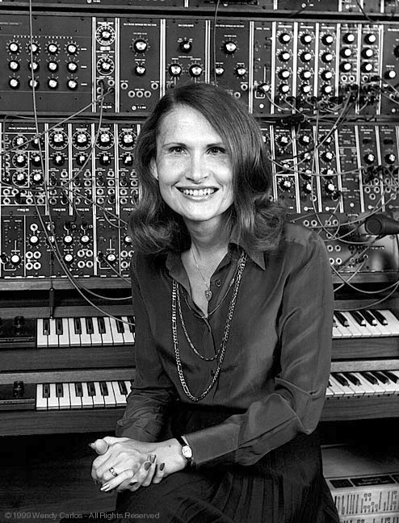

# Wendy Carlos

## Artist Profile

Composer Wendy Carlos spurred electronic music to new commercial heights during the late '60s, popularizing the synthesizer with the enormously successful Switched-On Bach album. Born in Pawtucket, RI, on November 14, 1939, Carlos pursued her M.A. in composition under Vladimir Ussachevsky and Otto Luening at Columbia University's famed Columbia-Princeton Electronic Music Center. Following her graduation, she moved to Manhattan, where she found work as a recording engineer. In Manhattan, she met Dr. Robert Moog and, not long afterward, she began playing the Moog synthesizer. She helped Bob Moog to create a touch-sensitive keyboard and in the development of the vocoder.

Carlos released her first recording, Switched-On Bach, in 1968. A showcase for the Moog synthesizer, Switched-On Bach interpreted the legendary composer's most renowned fugues and movements via state-of-the-art synth technology; purists were appalled, but the record captured the public's imagination and in time the album became the first classical record to be certified platinum by the RIAA. It also earned three Grammy Awards. A similar effort, The Well-Tempered Synthesizer, followed in 1969. In 1971 Carlos introduced the vocoder -- an electronic device designed to synthesize the human voice. After 1976's Brandenburg Concertos 3-5, Carlos and longtime collaborator, Rachel Elkind, wrote the score for Stanley Kubrick's 1980 adaptation of Stephen King's The Shining. Two years later, she wrote music for Tron, Disney's action movie about video games. Subsequent efforts include a spoof of Prokofiev's "Peter and the Wolf" (recorded with &quot;Weird Al&quot; Yankovic) and Switched-On Bach 2000.

## Artist Links

- [http://www.wendycarlos.com/](http://www.wendycarlos.com/)
- [https://en.wikipedia.org/wiki/Wendy_Carlos](https://en.wikipedia.org/wiki/Wendy_Carlos)
- [https://synthmuseum.com/magazine/0102cw.html](https://synthmuseum.com/magazine/0102cw.html)
- [https://www.imdb.com/name/nm0137793/](https://www.imdb.com/name/nm0137793/)

## See also

- [Switched-On Brandenburgs (The Complete Concertos)](Switched-On_Brandenburgs_The_Complete_Concertos.md)
- [Wendy Carlos's Clockwork Orange (Complete Original Score)](Wendy_Carloss_Clockwork_Orange_Complete_Original_Score.md)
