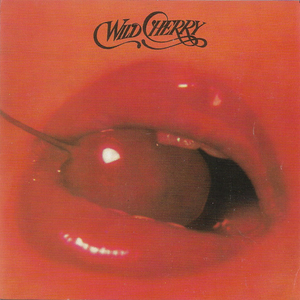

# Wild Cherry

By Wild Cherry

## Album Data

[Discogs URL](https://www.discogs.com/release/346778-Wild-Cherry-Wild-Cherry)

- Label: Epic
Sweet City (4)
- Formats: Vinyl, LP, Album, Stereo
- Genres: Rock, Funk / Soul, Funk, Disco
- Rating: 3.84
- Released: 1976
- Year: 1976
- Release ID: 346778
- Media condition: 
- Sleeve condition: 
- Speed: 
- Weight: 
- Notes: 

## Album Tracks

| **Position** | **Title** | **Duration** |
|--------------|-----------|--------------|
| A1 | **Play That Funky Music** | 5:00 |
| A2 | **The Lady Wants Your Money** | 4:14 |
| A3 | **99½** | 3:00 |
| A4 | **Don't Go Near The Water** | 3:15 |
| B1 | **Nowhere To Run** | 3:07 |
| B2 | **I Feel Sanctified** | 3:45 |
| B3 | **Hold On** | 4:11 |
| B4 | **Get It Up** | 3:01 |
| B5 | **What In The Funk Do You See** | 3:35 |

## Artist Roles

| **Name** | **Role** |
|----------|----------|
| **Robert Parissi** | Arranged By |
| **Wild Cherry** | Arranged By |
| **Becky Goldstein** | Backing Vocals |
| **Tampa Lann** | Backing Vocals |
| **Allen Wentz** | Bass, Synthesizer, Vocals |
| **Bob Rath** | Concept By [Cover] |
| **Ronald Beitle** | Drums, Vocals |
| **Ken Hamann** | Engineer, Advisor [Technical Advisor] |
| **Carl Maduri** | Executive-Producer |
| **Chuck Berginc** | Horns |
| **Jack Brandiar** | Horns |
| **Joe Eckert** | Horns |
| **Rick Singer** | Horns |
| **Robert Parissi** | Lead Guitar, Lead Vocals |
| **Bryan Bassett** | Lead Guitar, Vocals |
| **Bruno Bornino** | Liner Notes |
| **Carl Maduri** | Mixed By |
| **Ken Hamann** | Mixed By |
| **Robert Parissi** | Mixed By |
| **Frank Laffitte** | Photography By |
| **Robert Parissi** | Producer |

