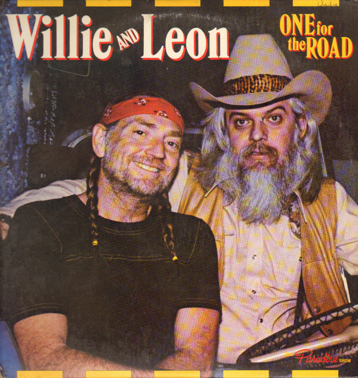

# One For The Road

By Willie Nelson

## Album Data

[Discogs URL](https://www.discogs.com/release/1712667-Willie-And-Leon-One-For-The-Road)

- Label: Columbia
Columbia
- Formats: Vinyl, LP, Album, Stereo
- Genres: Folk, World, & Country, Country
- Rating: 3.87
- Released: 1979-06-00
- Year: 1979
- Release ID: 1712667
- Media condition: 
- Sleeve condition: 
- Speed: 
- Weight: 
- Notes: 

## Album Tracks

| **Position** | **Title** | **Duration** |
|--------------|-----------|--------------|
| A1 | **Detour** | 2:24 |
| A2 | **I Saw The Light** | 3:04 |
| A3 | **Heartbreak Hotel** | 3:00 |
| A4 | **Let The Rest Of The World Go By** | 3:46 |
| A5 | **Trouble In Mind** | 2:40 |
| B1 | **Don't Fence Me In** | 2:25 |
| B2 | **The Wild Side Of Life** | 3:21 |
| B3 | **Ridin' Down The Canyon** | 3:20 |
| B4 | **Sioux City Sue** | 3:15 |
| B5 | **You Are My Sunshine** | 2:49 |
| C1 | **Danny Boy** | 3:58 |
| C2 | **Always** | 2:16 |
| C3 | **Summertime** | 2:27 |
| C4 | **Because Of You** | 2:04 |
| C5 | **Am I Blue** | 2:16 |
| D1 | **Tenderly** | 3:58 |
| D2 | **Far Away Places** | 3:08 |
| D3 | **That Lucky Old Sun** | 2:38 |
| D4 | **Stormy Weather** | 2:35 |
| D5 | **One For My Baby And "One More For The Road"** | 2:32 |

## Artist Roles

| **Name** | **Role** |
|----------|----------|
| **Leon Russell** | Arranged By |
| **Virginia Team** | Art Direction |
| **Jim Boatman** | Backing Vocals |
| **Bee Spears** | Bass |
| **Chris Ethridge** | Bass |
| **Bill Johnson (12)** | Design |
| **Paul English** | Drums |
| **Rex Ludwick** | Drums |
| **Roger Linn** | Engineer |
| **Jody Payne** | Guitar, Backing Vocals |
| **Mickey Raphael** | Harmonica |
| **Bernie Grundman** | Mastered By |
| **John Gallie** | Organ |
| **Ambrose Adekoya Campbell** | Percussion |
| **Charlyn Zlotnik** | Photography By [Back Photograph & Inner Gatefold] |
| **Melinda Wilkman** | Photography By [Front Photograph] |
| **Larry Dixon (2)** | Photography [Inner Gatefold] |
| **Tom Kemp** | Photography [Inner Gatefold] |
| **Leon Russell** | Producer |
| **Willie Nelson** | Producer |
| **Marty Grebb** | Saxophone |
| **Willie Nelson** | Vocals |
| **Willie Nelson** | Vocals, Guitar |
| **Leon Russell** | Vocals, Keyboards |

