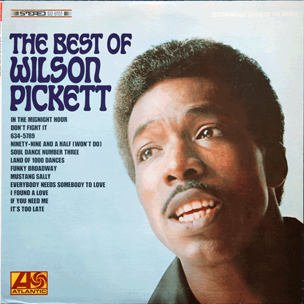

# The Best Of Wilson Pickett

By Wilson Pickett

## Album Data

[Discogs URL](https://www.discogs.com/release/2777469-Wilson-Pickett-The-Best-Of-Wilson-Pickett)

- Label: Atlantic
Friday Music
- Formats: Vinyl, LP, Compilation, Reissue, Mono
- Genres: Funk / Soul
- Rating: 4.67
- Released: 2011
- Year: 1967
- Release ID: 2777469
- Media condition: 
- Sleeve condition: 
- Speed: 
- Weight: 
- Notes: 

## Album Tracks

| **Position** | **Title** | **Duration** |
|--------------|-----------|--------------|
| A1 | **In The Midnight Hour** | 2:30 |
| A2 | **I Found A Love** | 2:25 |
| A3 | **634-5789** | 2:52 |
| A4 | **If You Need Me** | 2:34 |
| A5 | **Mustang Sally** | 3:04 |
| A6 | **Don't Fight It** | 2:30 |
| B1 | **Everybody Needs Somebody To Love** | 2:13 |
| B2 | **It's Too Late** | 3:03 |
| B3 | **Ninety-nine And A Half (Won't Do)** | 2:35 |
| B4 | **Funky Broadway** | 2:33 |
| B5 | **Soul Dance Number Three** | 2:38 |
| B6 | **Land Of 1000 Dances** | 2:23 |

## Artist Roles

| **Name** | **Role** |
|----------|----------|
| **Joe Reagoso** | Remastered By |
| **Kevin Gray** | Remastered By |

